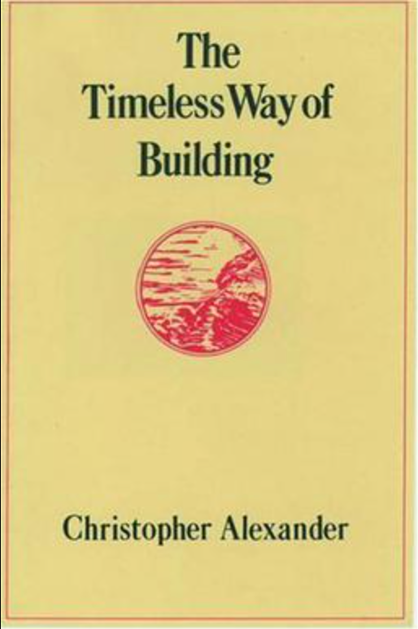
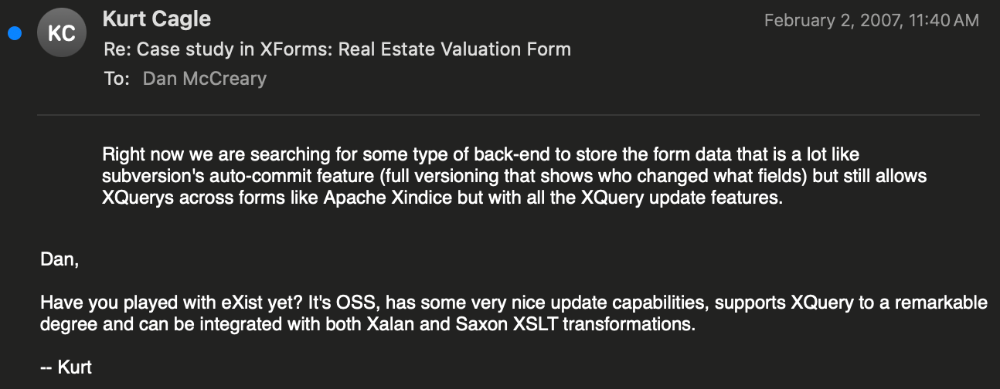

# About the ATAM/NoSQL Project

Early in my career, I worked for Bell Labs.
I met a coworker named [Bjarne Stroustrup](https://en.wikipedia.org/wiki/Bjarne_Stroustrup) who was the principal driver behind [C++](https://en.wikipedia.org/wiki/C%2B%2B#History). I was also exposed to [Objective C](https://en.wikipedia.org/wiki/Objective-C) when I worked for Steve Jobs at NeXT Computer.  I realized that
it really didn't matter what flavor of programming language
you used as long as you used good [Design Patterns](https://en.wikipedia.org/wiki/Design_Patterns).  This brought me to read about the origin of design patterns and the incredible book [A Timeless Way of Building](https://en.wikipedia.org/wiki/The_Timeless_Way_of_Building).  The key word here was **timeless** because it focused on understanding the underlying principles around a topic that didn't vary with the release of the next version of a software system.

I resolved to not write a book on the latest bugs in Windows 3.1.  The shelf life of that book was less than six months.  But if I could find the underlying patterns in the way that we represent data, that book would be timeless!

## The Day I Learned about eXist-DB

I had a transformative experience starting around Feb 2, 2007, at 11:40 AM.  That was the exact day and time that my friend [Kurt Cagle](https://www.linkedin.com/in/kurtcagle/) suggested that I try out the [eXist](https://exist-db.org/) database.  My life
was about to take a surprising turn.

I was working on a complex forms project where each form
"Save" had to perform about 45 inserts into a RDBMS.  That process, of shredding the document into individual parts, was very complex and we had allocated six months to that project.

But with eXist, we could perform all that work in a single line of code.  I recall staring at that single line for what must
have been 20 minutes.  Could it really be this simple?  Why
had I never heard about this?  Why did they only teach me
about RDBMS systems in college?  How could I have been such
a fool?

I vowed NEVER to be caught off guard again.  I vowed I would
travel the world to know the best way to store knowledge.  That
was the basis of a new conference (NoSQL Now!) I helped orchestrate. From that came the book [Making Sense of NoSQL](https://www.manning.com/books/making-sense-of-nosql) which I wrote with my wife, Ann Kelly.

But my journey didn't end with the publication of the book.  Granted, I did become an expert at helping companies select
databases.  However, to my utter frustration, despite objective evidence, companies often made poor decisions.
So I had to start to study why their cognitive [bias](./bias.md) got in the way.

