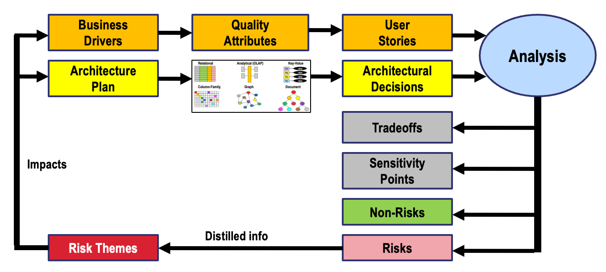

# ATAM Database Selection Process

In this section, we take the [Standard ATAM Process](./atam-process.md) and modify
it for the specialized task of selecting the right database architecture for a project.

