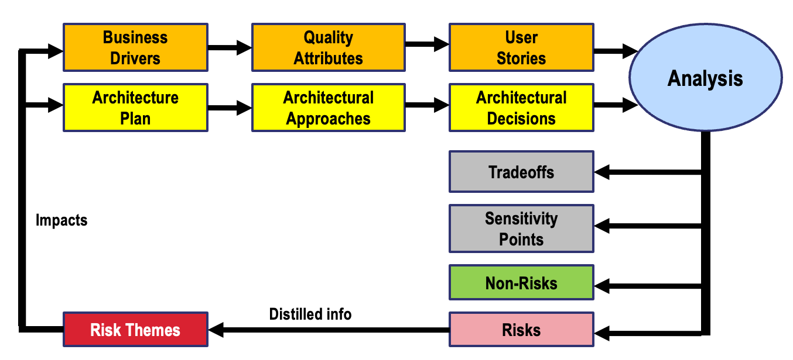

# Architectural Tradeoff Analysis Method Process

The Architectural Tradeoff Analysis Method (ATAM) is a structured method for evaluating software architecture with respect to multiple quality attributes. Developed by the Software Engineering Institute (SEI) at Carnegie Mellon University, ATAM helps to understand a system's behavior and determine if it has the right architecture to support the goals of the project. Below is a summary of the ATAM process according to the provided image.

**Goals of the ATAM Process:** The primary goals of the ATAM are to:

1.  Identify the consequences of architectural decisions.
2.  Identify risks and non-risks associated with the architecture.
3.  Assess the tradeoffs in the architectural approach, particularly those involving quality attributes.
4.  Provide a framework to make informed decisions that balance these tradeoffs.

**Steps of the ATAM Process:**

1.  **Business Drivers**: This step involves understanding the strategic goals and objectives of the business, which will drive the architectural decisions. This includes constraints, functional and non-functional requirements, and aspirations that shape the architecture.

2.  **Architecture Plan**: The architecture plan is the outline or blueprint of the system's architecture. It includes details on the architectural style, patterns, and structural organization.

3.  **Quality Attributes**: Quality attributes are the non-functional requirements such as performance, security, maintainability, and usability that the system must satisfy.

4.  **Architectural Approaches**: These are the strategies or techniques used to address the quality attributes in the architecture plan, including the use of specific design patterns or systems principles.

5.  **User Stories**: User stories provide a high-level description of functionality from an end-user perspective. They help to ensure that the architecture addresses real user needs.

6.  **Architectural Decisions**: This step involves making concrete decisions about the architecture, which are informed by the business drivers, quality attributes, and architectural approaches.

7.  **Analysis**: The analysis is the core of the ATAM, where the architectural decisions are scrutinized. This stage is where the architectural strategies are evaluated against the desired quality attributes through various analysis techniques.

**Documents Produced by the ATAM Process:**

1.  **Tradeoffs**: This document captures the analysis of various architectural decisions and their impact on different quality attributes, revealing where compromises are made.

2.  **Sensitivity Points**: These are the points in the architecture that are sensitive to changes. Understanding these helps in predicting the impact of changes on the system's quality attributes.

3.  **Non-Risks**: These are architectural aspects that have been determined not to pose a risk to the project. They are typically well-understood areas with known solutions.

4.  **Risks**: These are potential problems that could threaten the project's success. They might stem from ambitious quality attribute goals, reliance on novel technology, or other uncertainties in the architecture.

**Distilled Information**: As a result of the ATAM process, distilled information is produced, which encompasses the identified risks, non-risks, sensitivity points, and tradeoffs. This distilled information helps stakeholders make informed decisions about the architecture and the project.

**Risk Themes**: Throughout the ATAM process, certain themes of risk may emerge. These are broad areas of concern that need to be addressed by the project team to ensure the architecture can meet its goals. Risk themes help prioritize subsequent actions and refine the architecture.

**Impacts**: The identified risks, non-risks, sensitivity points, and tradeoffs have direct impacts on the project. The analysis of these impacts is crucial for planning, mitigation, and ensuring that the architecture aligns with the business drivers.

In conclusion, the ATAM process is a comprehensive method that assesses software architecture rigorously to ensure it aligns with business goals and adequately addresses quality requirements. The process involves a detailed evaluation of tradeoffs, risks, and non-risks, culminating in a well-informed architectural strategy that is essential for the successful delivery of the software system.