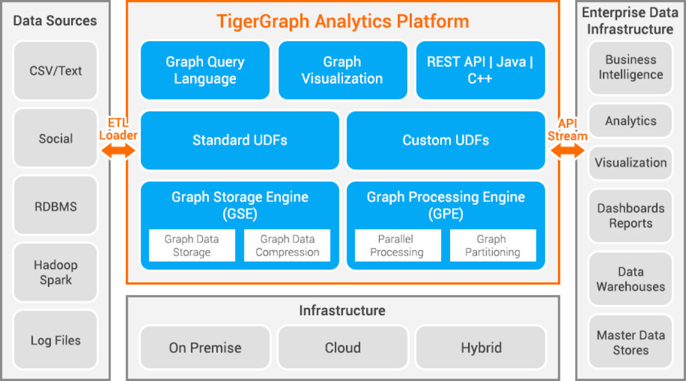

# TigerGraph Scale-Out Graph Database Case Study (2017)

 

    
Technical Case Study Prompt

Given to Claude Sonnet 4.0 in July 2025

Title: TigerGraph Case Study
Create a detailed technical case study of the use of the scaleout graph database TigerGraph around 2017. 
Focus on the limitations of single-node graphs and how TigerGraph got horizontal saleability right.

Use the STAR process:

1. Situation - give context to the case study 
2. Task - what was the challenge being addressed 
3. Approach - What was the architectural approach? 
4. Results - What were the results, both measurable and intangible

Create 10 real working references using the following format:
## References
1. [Title](WORKING_URL) - publication_date - publication_name - description_and_relevance

## Executive Summary

In September 2017, TigerGraph emerged from stealth mode with $31 million in Series A funding, introducing the world's first **Native Parallel Graph (NPG)** database platform designed to address the fundamental scalability limitations of single-node graph databases. This case study examines how TigerGraph's innovative distributed architecture enabled enterprise-scale graph analytics that were previously impossible with existing solutions like Neo4j, ultimately establishing a new paradigm for horizontally scalable graph computing.

## Situation: The Single-Node Graph Database Bottleneck

### Market Context in 2017

By 2017, graph databases had gained significant traction for modeling complex relationships in applications ranging from social networks to fraud detection. Neo4j, launched in 2007 with its 1.0 enterprise release in 2010, dominated the market as the leading graph database solution. However, the industry faced a critical scalability ceiling that limited graph databases to departmental use cases rather than enterprise-wide deployment.

### Single-Node Architecture Limitations

Traditional graph databases like Neo4j were architected as single-node systems, which created several fundamental bottlenecks:

**Memory Constraints**: Graph databases achieved their traversal performance by maintaining extensive in-memory indexes of node and relationship structures. Single-node architectures were limited by the memory capacity of individual servers, typically restricting graphs to hundreds of millions of nodes and relationships. As Gaurav Deshpande, TigerGraph's VP of Marketing, noted: *"When Neo4j came out in 2007, the size of the database being deployed as a graph was on the order of 200 GB or maybe as much as 500 GB. The scale has changed considerably, and now a large dataset is on the order of 10 TB."*

**Compute Bottlenecks**: Complex graph algorithms like PageRank, community detection, or shortest path calculations required significant computational resources. Single-node systems could not parallelize these operations across multiple machines, limiting their applicability to large-scale analytics problems.

**The "Single-Node Ceiling"**: Organizations found themselves constrained by what became known as the "single-node ceiling," where the benefits of graph modeling were offset by performance limitations. Many enterprises successfully implemented graph databases for pilot projects but struggled to scale them to production workloads involving billions of relationships.

**Storage and Performance Trade-offs**: As graph sizes exceeded single-node storage capacity, performance degraded significantly. The need to swap graph data between memory and disk eliminated the performance advantages that made graph databases attractive for real-time applications.

## Task: Addressing Enterprise-Scale Graph Computing Requirements

### Emerging Enterprise Demands

By 2017, several factors were driving demand for scalable graph solutions:

**Big Data Growth**: The volume of interconnected data was exploding. Social media platforms, financial networks, and IoT systems were generating graphs with billions of nodes and trillions of relationships that exceeded single-node capabilities.

**Real-Time Requirements**: Enterprises needed sub-second response times for graph analytics in production applications. Use cases like fraud detection, recommendation engines, and supply chain optimization required immediate insights that single-node systems could not deliver at scale.

**Complex Analytics**: Organizations wanted to perform sophisticated graph algorithms involving multiple hops (10+ relationship traversals) that were computationally prohibitive on single-node systems.

### Specific Technical Challenges

TigerGraph identified several key technical challenges that needed to be solved:

1. **Horizontal Scaling**: How to distribute graph data across multiple nodes while maintaining traversal performance
2. **Parallel Processing**: How to execute graph algorithms in parallel across distributed nodes
3. **Real-Time Updates**: How to handle continuous data ingestion while serving analytical queries
4. **Query Optimization**: How to minimize cross-node communication during distributed graph traversals
5. **Operational Simplicity**: How to provide automatic partitioning and scaling without requiring manual sharding

## Approach: Native Parallel Graph (NPG) Architecture

### Fundamental Architectural Innovation

TigerGraph's breakthrough was developing what they termed the **Native Parallel Graph (NPG)** architecture—a distributed system designed from the ground up to handle massive graph workloads. Unlike other graph databases that retrofitted distribution onto single-node designs, TigerGraph built a natively distributed platform.

### Core Technical Components

**Graph Storage Engine (GSE)**: TigerGraph developed a custom storage engine optimized for distributed graph data. The GSE co-located with the processing engine for efficient data access and implemented sophisticated compression techniques achieving typical 10x compression ratios. For example, 1TB of input data would require only 100GB of system memory after compression and optimization.

**Graph Processing Engine (GPE)**: The GPE provided built-in parallelism using a MapReduce-based computing model. Unlike traditional approaches, TigerGraph made each vertex and edge not just a storage unit but also a computational unit, enabling massive parallelism across the entire graph structure.

**Automatic Partitioning**: TigerGraph implemented ID hash-based mapping that automatically distributed vertices and edges across cluster nodes. The system used intelligent partitioning algorithms that minimized cross-node communication during traversals while maintaining load balance.

**GSQL Query Language**: TigerGraph developed GSQL, a SQL-like graph query language that combined familiar SQL syntax with graph-specific operations. GSQL was Turing-complete and designed for distributed execution, automatically optimizing queries across the cluster.

### Distributed Computing Model

**Bulk Synchronous Parallel (BSP) Processing**: TigerGraph unified MapReduce and parallel graph processing paradigms using the BSP model, enabling developers to implement scalable parallel graph algorithms efficiently.

**Accumulator Variables**: GSQL provided special accumulator variables for distributed computations—temporary, shared variables that existed only during query execution and could be safely updated by multiple execution threads.

**Adaptive Query Routing**: The system could run multiple graph engines in an active-active configuration, each optimized for different query types, with intelligent routing based on query characteristics.

### Performance Optimizations

**Data Locality**: The system optimized data placement to take advantage of disk locality, in-memory caching, and CPU cache efficiency, minimizing data movement during computations.

**Compression and Decompression**: TigerGraph implemented efficient compression algorithms that often allowed processing without full decompression, further reducing memory requirements and improving cache efficiency.

**Multi-threaded Execution**: The system automatically scaled computation across all available CPU cores and threads, providing what TigerGraph termed "automatic computational parallelism."

## Results: Breakthrough Performance and Enterprise Adoption

### Measurable Performance Improvements

TigerGraph's NPG architecture delivered dramatic performance improvements over single-node alternatives:

**Loading Performance**: TigerGraph achieved loading speeds of 50-150GB per hour per machine, compared to over 24 hours for equivalent datasets on traditional graph databases.

**Query Performance**: The system demonstrated the ability to traverse hundreds of millions of vertices/edges per second per machine. In benchmark tests against Neo4j using Twitter data, TigerGraph achieved 800,000 row updates per second compared to Neo4j's 14,000 rows per second.

**Deep Link Analytics**: TigerGraph could handle queries with 10+ hops in sub-second time, while competing systems often timed out at 3-hop queries. This capability enabled previously impossible analytical scenarios.

**Scalability Metrics**: The platform demonstrated the ability to handle graphs with 100+ billion vertices and 600+ billion edges on clusters of just 20 commodity machines, processing over 2 billion daily events in real-time.

### Early Enterprise Customer Success

**China Mobile**: Deployed TigerGraph to monitor 600 million cell phone users for fraud detection, analyzing calling patterns to identify spam and fraudulent activities in real-time across their massive subscriber base.

**Alipay**: Implemented what TigerGraph claimed was "arguably the world's largest graph database" for anti-money laundering operations, processing the complex transaction networks of Alibaba's payment ecosystem.

**Visa**: Leveraged TigerGraph for transaction analysis and fraud detection across their global payment network, enabling real-time risk assessment at unprecedented scale.

**Uber**: Used TigerGraph for analyzing rider and driver relationships, route optimization, and demand forecasting across their global transportation network.

### Industry Recognition and Business Impact

**Funding Success**: TigerGraph's $31 million Series A round was one of the largest financing rounds in graph database history at the time, making it the second most well-funded graph startup after Neo4j.

**Market Positioning**: The company successfully positioned itself as the solution for enterprises hitting the "single-node ceiling," focusing on high-end, real-time, large-scale problems that competitors couldn't address.

**Technology Innovation**: TigerGraph filed 15 patents for their distributed graph technologies, with founder Yu Xu holding 26 total patents in distributed systems and databases.

### Intangible Benefits

**Market Education**: TigerGraph's emergence educated the market about the limitations of single-node graph architectures and demonstrated the potential for enterprise-scale graph analytics.

**Ecosystem Development**: The company's success attracted talent and investment to the graph database space, accelerating overall industry innovation.

**Use Case Expansion**: By solving scalability limitations, TigerGraph enabled new categories of graph applications that were previously impractical, expanding the total addressable market for graph technologies.

**Competitive Response**: TigerGraph's success prompted established players like Neo4j to invest more heavily in distributed architectures and scaling solutions.

## Technical Innovation Impact

### Paradigm Shift in Graph Database Architecture

TigerGraph's NPG architecture represented a fundamental shift from single-node to distributed-first design in graph databases. This approach influenced the broader industry:

**Native Distribution**: The success demonstrated that bolt-on distribution was insufficient—truly scalable graph systems needed to be designed as distributed platforms from inception.

**Computational Graph Model**: The concept of making vertices and edges computational units rather than just storage units became influential in graph processing system design.

**Automatic Scaling**: TigerGraph's automatic partitioning and scaling capabilities raised expectations for operational simplicity in distributed graph systems.

### Long-term Industry Influence

The success of TigerGraph's scale-out approach in 2017 validated several key principles that became industry standards:

- **Horizontal scaling as the primary growth path** for graph databases
- **Native parallel processing** as essential for enterprise graph analytics
- **Automatic partitioning** as preferable to manual sharding
- **Real-time updates** as a requirement for production graph systems

## Conclusion

TigerGraph's emergence from stealth in 2017 marked a pivotal moment in graph database evolution. By successfully addressing the fundamental scalability limitations of single-node architectures through their Native Parallel Graph platform, TigerGraph enabled enterprise-scale graph analytics that were previously impossible. The company's technical innovations, combined with early success at major enterprise customers like China Mobile, Alipay, and Visa, demonstrated that distributed graph computing could deliver both the relationship-modeling advantages of graph paradigms and the scalability required for modern data-intensive applications.

The case study illustrates how architectural innovation can create new market categories and expand the total addressable market for database technologies. TigerGraph's success not only solved immediate customer problems but also established new expectations for graph database capabilities, influencing the entire industry's direction toward distributed, horizontally scalable graph platforms.

## References

1. [TigerGraph Emerges With $31M in Series A Funding, Introduces Real-Time Graph Platform](https://info.tigergraph.com/tigergraph-seriesa-funding) - September 19, 2017 - TigerGraph Press Release - Official announcement of TigerGraph's emergence from stealth with $31M funding and launch of native parallel graph platform

2. [TigerGraph Emerges with Native Parallel Graph Database](https://www.aiwire.net/2017/09/20/tigergraph-emerges-native-parallel-graph-database/) - September 20, 2017 - AI Wire - Detailed coverage of TigerGraph's launch, including technical architecture details and early customer implementations

3. [The Graph Database Poised To Pounce On The Mainstream](https://www.nextplatform.com/2018/09/19/the-graph-database-poised-to-pounce-on-the-mainstream/) - September 19, 2018 - The Next Platform - Comprehensive analysis of TigerGraph's competitive positioning and technical advantages over single-node alternatives

4. [TigerGraph: The parallel graph database explained](https://www.infoworld.com/article/2268730/tigergraph-the-parallel-graph-database-explained.html) - May 2, 2018 - InfoWorld - Technical deep-dive into TigerGraph's Native Parallel Graph architecture and distributed computing model

5. [Introducing TigerGraph, a Native Parallel Graph Database](https://thenewstack.io/introducing-tigergraph-native-parallel-graph-database/) - September 20, 2021 - The New Stack - Analysis of TigerGraph's architectural innovations and competitive advantages in distributed graph computing

6. [Half-Terabyte Benchmark Neo4j vs. TigerGraph](https://dzone.com/articles/half-terabyte-benchmark-neo4j-vs-tigergraph) - October 1, 2018 - DZone - Performance benchmark comparison demonstrating TigerGraph's scalability advantages with large datasets

7. [TigerGraph emerges from undergrowth with 2.0 release in its jaws](https://www.theregister.com/2018/02/27/tigergraph_launches_realtime_graph_analytics_collaboration/) - February 27, 2018 - The Register - Coverage of TigerGraph's 2.0 platform launch and enterprise customer adoption milestones

8. [Scalable Graph Database Technology: Combining Big Data and Real-Time Analytics](https://www.dataversity.net/scalable-graph-database-technology-combining-big-data-real-time-analytics/) - May 2, 2018 - DATAVERSITY - Interview with TigerGraph executives discussing technical architecture and multi-tenancy capabilities

9. [Internal Architecture - TigerGraph DB](https://docs.tigergraph.com/tigergraph-server/current/intro/internal-architecture) - Current - TigerGraph Documentation - Official technical documentation of TigerGraph's Native Parallel Graph architecture and core system components

10. [Native Graph Database Engine](https://www.tigergraph.com/tigergraph-db/) - Current - TigerGraph Website - Official description of TigerGraph's technical approach and distributed graph computing capabilities
