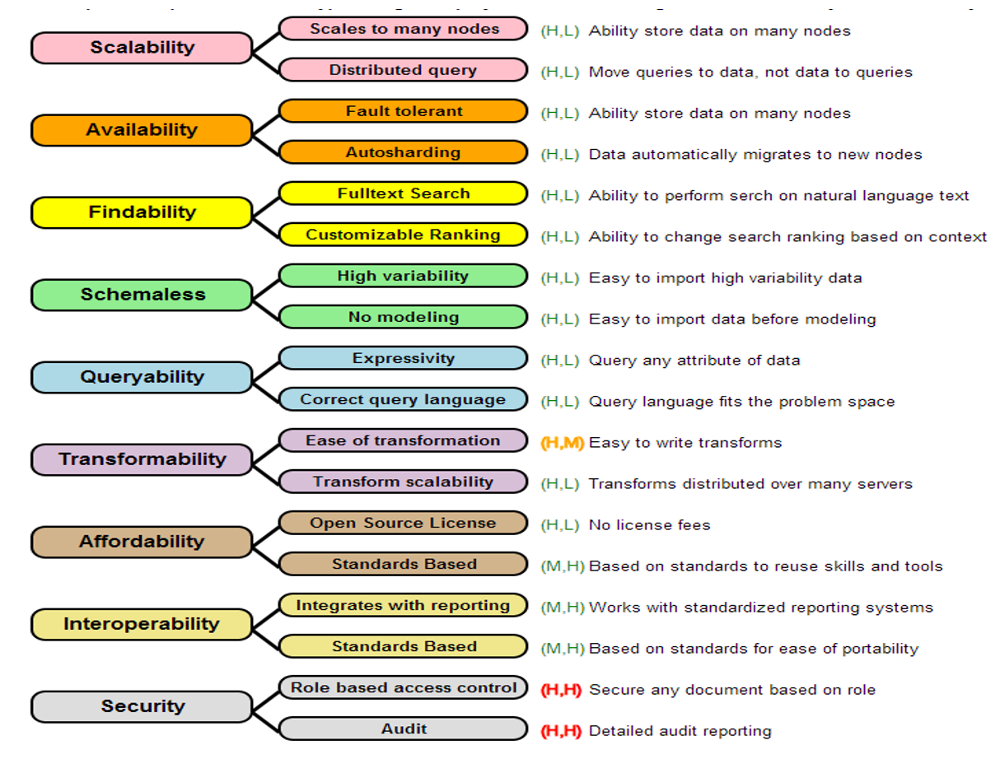
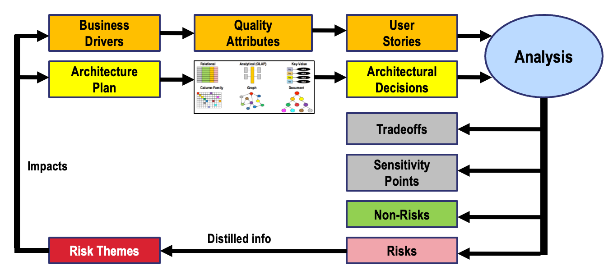

# Chapter 1: The ATAM Method

## Summary

This chapter introduces the Carnegie Mellon University Software Engineering Institute's Architecture Tradeoff Analysis Method (ATAM) — the gold standard for evaluating architectural decisions against competing quality requirements. Students learn the nine-step ATAM process, the roles of stakeholders and evaluation teams, how to elicit and document business drivers and architectural approaches, and how ATAM produces actionable output artifacts including risk lists and architectural decision records. This chapter establishes the analytical framework used throughout the rest of the book to evaluate database choices.

## Concepts Covered

This chapter covers the following 22 concepts from the learning graph:

1. Architecture Tradeoff Analysis
2. Quality Attribute Workshop
3. Utility Tree
4. Quality Attribute Scenario
5. Architectural Driver
6. Sensitivity Point
7. Tradeoff Point
8. Architectural Risk
9. Non-Risk
10. Risk Theme
11. Utility Tree Prioritization
12. ATAM Stakeholder Roles
13. Business Driver
14. Architectural Approach
15. ATAM Evaluation Team
16. ATAM Nine-Step Process
17. Architectural Decision Record
18. Quality Attribute Refinement
19. Scenario Stimulus
20. Scenario Response Measure
21. ATAM Output Artifacts
22. Software Architecture View

## Prerequisites

This chapter assumes only the prerequisites listed in the [course description](../../course-description.md).

---

!!! mascot-welcome "Welcome to Chapter 1!"
    
    I'm Dex — your database architecture guide. This chapter hands you the most powerful tool in this book: ATAM, the structured method that turns "which database should we use?" from a heated opinion contest into a documented, defensible decision. By the end, you'll have the vocabulary and the analytical framework that every subsequent chapter builds on. Let's analyze the tradeoffs!

## Why Database Selection Fails

The most expensive architectural mistakes are often the quietest. A team evaluating databases rarely sits down and decides to pick the wrong one — instead, they pick the familiar one, the one that worked on the last project, the one a respected engineer advocated for at a conference, or the one whose marketing material aligned neatly with their intuitions. Three years later, the system is in production, data is locked in, and engineers spend more time working around the database than working with it.

The root cause is almost never ignorance of the database's features. It is the absence of a structured method for connecting architectural requirements to architectural decisions. Without such a method, teams optimize for what they can measure easily (developer familiarity, query syntax, benchmark numbers) rather than for what actually drives system success (consistency guarantees under failure, replication topologies, scalability limits, operational complexity at scale).

This course teaches a disciplined alternative: the **Architecture Tradeoff Analysis Method (ATAM)**, developed at the Carnegie Mellon University Software Engineering Institute. ATAM gives teams a shared vocabulary, a repeatable process, and a set of artifacts that make architectural tradeoffs explicit, visible, and defensible. Applied to database selection, it transforms what is usually a partially-informed debate into a structured decision with documented rationale.

Every chapter in this book applies ATAM concepts. This chapter builds the foundation.

## Architecture Tradeoff Analysis

**Architecture Tradeoff Analysis** (also called ATAM) is a structured evaluation method that helps teams assess how well a proposed architecture satisfies competing quality requirements. It was developed by researchers at the CMU Software Engineering Institute (SEI) in the late 1990s, with the seminal description published by Kazman, Klein, and Clements in 2000.

The central insight of ATAM is that architectural decisions rarely optimize a single quality attribute in isolation. A database that maximizes write throughput typically relaxes consistency guarantees. A system designed for five-nines availability often requires operational complexity that strains small teams. A schema optimized for rich ad-hoc queries is rarely the same schema that handles million-records-per-second ingestion. Every architectural choice is, at its core, a negotiated tradeoff — and ATAM is the method for making those negotiations explicit.

ATAM is not a scoring system that produces a "best" answer. It is a structured conversation that surfaces the right questions, documents the tradeoffs inherent in candidate architectures, identifies where architectural risks concentrate, and produces artifacts that justify the final decision. Applied rigorously, it replaces "we chose PostgreSQL because it's reliable" with a documented utility tree, a prioritized scenario list, a tradeoff analysis, and an architectural decision record.

## ATAM Stakeholder Roles

Before any analysis can happen, ATAM requires that the right people are in the room. Architectural decisions affect different stakeholders differently, and surfacing those differences is one of ATAM's core functions. ATAM defines three broad **stakeholder** categories:

**Project decision makers** are the people with authority to commit resources and make binding architectural choices. In a database selection context, this typically includes senior engineering leadership, product managers, and the system architects who will own the decision. They define the business drivers that constrain the design space.

**Architects and developers** are the technical practitioners who understand the proposed architecture's implementation details. They present the architectural approaches under consideration, identify where quality attribute tradeoffs emerge, and respond to scenario-based challenges during the analysis phase.

**Users and operators** represent the people who will live with the architecture in production. Operators understand failure modes, operational complexity, and maintenance burden — perspectives that are systematically underweighted when architecture decisions are driven solely by developer convenience.

The following table summarizes the primary stakeholder types and their contributions to the ATAM process:

| Stakeholder Type | Primary Contribution | Risk of Exclusion |
|-----------------|---------------------|-------------------|
| Project decision makers | Business drivers, priority weighting | Architectural decisions misaligned with organizational goals |
| Architects / senior engineers | Architectural approach presentation, sensitivity point identification | Incomplete tradeoff analysis |
| Operations / SRE | Failure mode scenarios, operational complexity assessment | Underestimated operational risk |
| End users / consumers | Response measure requirements ("how fast is fast enough?") | Scenarios that pass on paper but fail in practice |
| Security / compliance | Regulatory constraints, threat model scenarios | Compliance violations discovered post-deployment |

## The ATAM Evaluation Team

The **ATAM Evaluation Team** is a distinct group from the project stakeholders described above. It is the team that *conducts* the analysis, as opposed to the stakeholders who *participate* in it. This separation is intentional: the evaluation team acts as a neutral analytical body that helps elicit scenarios, challenges architectural assumptions, and documents findings without having a stake in any particular outcome.

In formal SEI-style ATAM engagements, the evaluation team consists of a trained facilitator, a questioner, a recorder, and optionally domain experts. In the more pragmatic applications common in industry, the evaluation team is often a small group of architects who are respected but not directly responsible for the decision being made — a lightweight separation that preserves the analytical independence the method requires.

The key principle is that effective tradeoff analysis requires someone asking uncomfortable questions. The ATAM Evaluation Team's job is to be that someone, systematically, using the scenario-based challenge structure the method provides.

## Business Drivers

A **business driver** is an organizational goal or constraint that shapes what a system must accomplish before any technical analysis begins. Business drivers translate strategic intent into architectural requirements. They are the reason the system exists, and they determine which quality attributes matter most for this particular project.

Typical business drivers for a database selection decision include:

- **Time to market pressure** — a startup choosing a document database for schema flexibility because the product schema will change weekly during the discovery phase
- **Regulatory compliance** — a financial system requiring strong consistency guarantees and full audit trails because regulators mandate it
- **Scale requirements** — an IoT platform expecting ten billion events per day that makes write throughput the dominant architectural driver
- **Cost constraints** — a cost-conscious team ruling out managed services in favor of self-hosted deployments, which shifts the operational complexity tradeoff
- **Team expertise** — an organization with deep PostgreSQL expertise treating migration risk as a business driver, adding a premium to any alternative that requires retraining

Business drivers are not the same as quality attributes. "We need high availability" is a quality attribute. "We operate a healthcare platform where downtime results in regulatory fines and patient harm" is the business driver that makes high availability critical. The distinction matters because ATAM connects quality attribute prioritization directly to business drivers — if a team cannot articulate why a quality attribute matters in business terms, they cannot reliably prioritize it against competing attributes.

## Quality Attributes and Their Refinements

**Quality attributes** are the non-functional characteristics by which architectural fitness is measured. In software systems, they are frequently called "ilities" — availability, scalability, durability, maintainability, security, and so on. In database selection, quality attributes define the dimensions along which candidate databases are evaluated.

The image below shows a quality tree — a visual representation of how quality attributes are organized hierarchically for a database selection decision:



In ATAM, quality attributes are not treated as flat checklist items. Each quality attribute is broken down into one or more **quality attribute refinements** — more specific sub-characteristics that make the attribute concrete enough to evaluate. This process of refinement is what allows ATAM to move from vague aspirations ("we need good performance") to specific, measurable scenarios.

For database selection, a typical set of quality attributes and their refinements looks like this:

| Quality Attribute | Example Refinements |
|------------------|---------------------|
| Performance | Write throughput under sustained load; read latency at p99; query execution time for complex joins |
| Availability | Uptime SLA (99.9% vs 99.999%); failover time; behavior during partial network failure |
| Consistency | Isolation level guarantees; behavior during concurrent writes; read-after-write semantics |
| Scalability | Horizontal scale-out behavior; sharding strategy; maximum data volume before performance degrades |
| Operability | Deployment complexity; monitoring and observability; backup and restore procedures |
| Security | Authentication mechanisms; encryption at rest and in transit; audit logging capabilities |

The **Quality Attribute Workshop (QAW)** is the structured facilitated session in which stakeholders collaboratively elicit, refine, and prioritize quality attributes. A QAW typically takes two to four hours for a moderately complex system. Participants brainstorm quality attributes from their stakeholder perspective, discuss conflicts between competing attributes, and converge on the set of attributes that will populate the utility tree. The QAW is where implicit architectural priorities become explicit for the first time.

## The Utility Tree

The **utility tree** is the central artifact of ATAM. It is a hierarchical structure that organizes quality attributes, their refinements, and specific quality attribute scenarios into a single visual representation of what the architecture must accomplish. The term "utility" reflects the goal: a good architecture maximizes the utility it delivers across all the quality dimensions that matter to stakeholders.

The utility tree has three levels:

1. **Root:** The single node labeled "Utility" — representing overall system goodness
2. **Quality attribute branches:** One branch per major quality attribute (performance, availability, consistency, etc.)
3. **Leaf nodes:** Specific, testable quality attribute scenarios — the concrete expressions of what each quality attribute means for this system

Think of the utility tree as the architectural equivalent of fitting a glove to a hand. Each quality attribute is a dimension of fit — just as each finger must fit individually for the glove to be useful, each quality attribute scenario must be satisfiable for the architecture to succeed. The tree makes these dimensions explicit, so teams can reason about them together rather than each carrying an invisible mental model.


!!! mascot-thinking "The Utility Tree: Your Most Reused Artifact"
    
    The utility tree is the concept you will use in *every single chapter* of this book. Relational, graph, column-family, document — every database paradigm gets evaluated the same way: against a prioritized utility tree. Internalize this structure now and the rest of the book snaps into place.

Before examining the interactive utility tree below, let's define the two key terms that appear on every leaf node.

#### Diagram: Interactive Utility Tree Explorer

<details markdown="1">
<summary>Interactive Utility Tree Explorer — click any node to see its scenario details and priority rating</summary>
Type: interactive-infographic
**sim-id:** utility-tree-explorer<br/>
**Library:** vis-network<br/>
**Status:** Specified

**Learning objective:** Analyzing (Bloom's level 4) — students examine the structure of a complete ATAM utility tree for a database selection scenario, identify how quality attributes decompose into refinements and scenarios, and interpret priority ratings.

**Canvas:** 900 × 560px, responsive to window resize. A vis-network hierarchical layout (direction: UD) is used for the tree. An info panel (300px wide) appears to the right of the tree when a node is selected.

**Node hierarchy and data:**

Root node (id: 0): label "Utility", color "#4a90d9", font size 18, shape "ellipse"

Quality attribute nodes (level 1, color "#f0a500", shape "box"):
- id: 1, label: "Performance"
- id: 2, label: "Availability"
- id: 3, label: "Consistency"
- id: 4, label: "Scalability"
- id: 5, label: "Operability"

Refinement nodes (level 2, color "#7db8e8", shape "box"):
- id: 10, label: "Write Throughput", parent: 1
- id: 11, label: "Read Latency", parent: 1
- id: 20, label: "Uptime SLA", parent: 2
- id: 21, label: "Failover Behavior", parent: 2
- id: 30, label: "Isolation Guarantees", parent: 3
- id: 31, label: "Read-After-Write", parent: 3
- id: 40, label: "Horizontal Scale-Out", parent: 4
- id: 41, label: "Data Volume Limits", parent: 4
- id: 50, label: "Operational Complexity", parent: 5
- id: 51, label: "Observability", parent: 5

Scenario leaf nodes (level 3, color "#e8f4e8", shape "box", border "#4a7c4a"):
Each leaf node displays a priority badge in the format (Importance, Difficulty): H=High, M=Medium, L=Low.

- id: 100, label: "Write 100K events/sec\n(H,H)", parent: 10
  info: { scenario: "Under sustained IoT ingestion load of 100,000 events per second, the database sustains write throughput with p99 write latency below 5ms.", stimulus: "Sustained 100K writes/sec for 4 hours", response: "All writes committed", measure: "p99 write latency < 5ms, zero write rejections", priority: "(H,H) — High importance, High difficulty" }

- id: 101, label: "p99 read < 10ms\n(H,M)", parent: 11
  info: { scenario: "Under normal operational load, 99th percentile read latency for single-key lookups remains below 10ms.", stimulus: "Mixed read workload at 10K QPS", response: "Reads served from primary or replica", measure: "p99 < 10ms", priority: "(H,M)" }

- id: 200, label: "99.99% uptime\n(H,H)", parent: 20
  info: { scenario: "The database cluster sustains 99.99% monthly availability measured at the application layer.", stimulus: "Normal operational load", response: "Service available", measure: "< 52 min downtime per year", priority: "(H,H)" }

- id: 201, label: "Failover < 30s\n(H,M)", parent: 21
  info: { scenario: "When the primary node fails, the cluster elects a new leader and resumes writes within 30 seconds.", stimulus: "Primary node becomes unavailable", response: "New primary elected, writes resume", measure: "Write gap < 30 seconds", priority: "(H,M)" }

- id: 300, label: "Serializable reads\n(H,H)", parent: 30
  info: { scenario: "Financial transactions require serializable isolation to prevent phantom reads in balance calculations.", stimulus: "Concurrent transactions modifying same account", response: "No phantom reads", measure: "Zero anomalous reads under concurrent load", priority: "(H,H)" }

- id: 301, label: "Read-your-writes\n(M,M)", parent: 31
  info: { scenario: "After a user updates their profile, subsequent reads from any replica return the updated value.", stimulus: "User writes profile update, immediately reads", response: "Updated value returned", measure: "Zero stale reads for the writing session", priority: "(M,M)" }

- id: 400, label: "Scale to 10TB\n(H,M)", parent: 40
  info: { scenario: "The database horizontally partitions data across nodes as volume grows to 10TB with no schema changes.", stimulus: "Data volume grows from 1TB to 10TB", response: "Query performance maintained", measure: "p99 read latency degrades < 20% vs 1TB baseline", priority: "(H,M)" }

- id: 500, label: "Single-cmd deploy\n(M,H)", parent: 50
  info: { scenario: "A new database node can be provisioned, configured, and added to the cluster using a single idempotent command.", stimulus: "Operations team adds a new node", response: "Node joins cluster, begins replication", measure: "Provisioning completes in < 10 minutes", priority: "(M,H)" }

**Interactions:**
- Clicking any leaf node opens the info panel on the right showing: Scenario description, Stimulus, Response, Response Measure, and Priority rating with color-coded badge (H=red, M=yellow, L=green).
- Clicking a refinement or quality attribute node collapses/expands its children.
- Hovering any node shows a tooltip with the full label.
- A "Reset View" button repositions the tree to the default centered view.
- Color-coded priority badge in each leaf label: (H,H) = red background, (H,M) = orange, (M,M) = yellow, (M,H) = yellow-orange.

**Legend panel (bottom-left):**
- Gold box: Quality Attribute
- Light blue box: Quality Attribute Refinement
- Light green box: Quality Attribute Scenario (leaf)
- Priority notation: (Importance, Difficulty) — H/M/L

**Responsive behavior:** On window resize, the canvas and info panel reflow to maintain usability at widths from 600px to 1400px.
</details>

## Quality Attribute Scenarios

A **quality attribute scenario** is the leaf-node unit of the utility tree. It is a concrete, testable statement of what the architecture must do under specified conditions. ATAM scenarios follow a six-part structure, each element of which constrains how the scenario can be evaluated:

1. **Source of stimulus** — the entity that triggers the event (a user, an external system, a hardware failure, a load spike)
2. **Scenario stimulus** — the specific event that occurs (a concurrent write storm, a node failure, a regulatory audit request)
3. **Artifact** — the part of the system affected (the database primary, a replication lag monitor, a transaction log)
4. **Environment** — the operational context at the time (peak load, partial network partition, scheduled maintenance window)
5. **Response** — what the system does in reaction to the stimulus
6. **Scenario response measure** — the quantitative or binary criterion that determines whether the response is acceptable

The **scenario stimulus** is the "what happens" of the scenario. The **scenario response measure** is the "how do we know it worked" — the quantitative threshold that distinguishes acceptable from unacceptable behavior. Without a response measure, a scenario is not testable, and untestable scenarios cannot drive architectural decisions.

Consider a concrete example from a financial transaction system:

- **Source:** A batch reconciliation process
- **Stimulus:** 50,000 concurrent read-modify-write transactions executing simultaneously
- **Artifact:** Account balance records in the primary database
- **Environment:** End-of-day peak, system under 80% of maximum rated load
- **Response:** All transactions complete with serializable isolation, no phantom reads
- **Response measure:** Zero consistency violations detected by post-batch audit; p99 transaction latency below 200ms

This scenario is actionable because it is specific. A team evaluating PostgreSQL versus CockroachDB versus Cassandra for this scenario can reason about each candidate's isolation guarantees and known latency characteristics. Without the response measure, "handles concurrent writes well" is not evaluable.

!!! mascot-warning "A Scenario Without a Response Measure Is Just a Wish"
    
    The most common ATAM mistake: writing scenarios that sound specific but have no measurable criterion. "The database performs well under load" is a wish. "p99 write latency remains below 5ms under 100,000 writes per second" is a scenario. If you cannot write a test that unambiguously passes or fails it, rewrite the scenario until you can.

## Utility Tree Prioritization

Not all scenarios are equally important, and not all are equally difficult for the candidate architectures to satisfy. **Utility tree prioritization** assigns each leaf-node scenario a two-dimensional rating that captures both dimensions:

- **Importance to stakeholders (H/M/L):** How critical is this scenario to the success of the system? A high importance scenario is one whose failure would be a system-level failure.
- **Difficulty to achieve (H/M/L):** How hard is it for the candidate architecture to satisfy this scenario? A high difficulty scenario identifies where architectural skill is required.

The most architecturally significant scenarios are those rated **(H, H)** — high importance and high difficulty. These are the scenarios that should dominate the analysis, because they are both critical and non-trivially satisfiable. Scenarios rated **(H, M)** and **(M, H)** form the second tier. Low-importance or low-difficulty scenarios are documented but consume less analysis time.

The prioritization matrix produces a ranked list that guides the rest of the ATAM analysis. Before examining candidate architectures, the evaluation team knows exactly which scenarios will be the most revealing stress tests.

## Architectural Approaches and Software Architecture Views

With a prioritized utility tree in hand, the analysis turns to the architectures under consideration. An **architectural approach** is a strategy, pattern, or technology choice that addresses one or more quality attribute scenarios. In database selection, architectural approaches include:

- Choosing a relational database with synchronous replication for strong consistency
- Using a key-value store with eventual consistency for maximum write throughput
- Implementing a leader-follower topology for read scaling with write serialization
- Selecting a graph database for traversal-heavy relationship queries
- Deploying a column-family store for time-series ingest with TTL-based expiration

Each architectural approach affects multiple quality attributes simultaneously. A single-leader relational topology improves write consistency but creates a write scalability ceiling. A leaderless eventual-consistency store removes that ceiling but introduces consistency complexity that must be handled at the application layer. These are the tradeoffs that ATAM analysis makes visible.

A **software architecture view** is a representation of an architectural approach from a particular stakeholder perspective. The most commonly used views in database architecture analysis are:

- **The component view** — what software components exist (primary, replicas, proxies, application layer)
- **The deployment view** — how components map to physical or virtual infrastructure (availability zones, regions, nodes)
- **The data flow view** — how data moves through the system (writes to primary, replication to followers, reads from replicas)
- **The sequence view** — how a specific scenario (e.g., a failover) plays out in time

Architecture views are not optional documentation. In ATAM, presenting multiple views of a candidate architecture is what allows the evaluation team and stakeholders to probe it meaningfully. An architecture described only in words cannot be stress-tested against concrete scenarios.

## Architectural Drivers

An **architectural driver** is a quality attribute scenario that is both high-priority and highly influential on the architectural decisions being made. Not every scenario in the utility tree is an architectural driver — many are satisfied trivially or are addressed by the same decisions that satisfy the (H,H) scenarios. Architectural drivers are the subset of scenarios whose specific requirements noticeably constrain the design space.

Identifying architectural drivers is the step that focuses the analysis. For a high-throughput IoT platform, write throughput and partition tolerance are likely architectural drivers. For a financial compliance system, serializable consistency and audit logging are drivers. For a social graph application, traversal performance and flexible schema evolution are drivers. The architectural drivers determine which database paradigms are viable candidates and which are immediately eliminated.

## Sensitivity Points and Tradeoff Points

Two of ATAM's most precise analytical concepts are **sensitivity points** and **tradeoff points**. Understanding the distinction between them is critical for using ATAM vocabulary correctly.

A **sensitivity point** is a property of one or more components that is critical to achieving a specific quality attribute. A small change in the value of a sensitivity point produces a large change in a quality attribute. Sensitivity points identify where architectural decisions are fragile — where getting the details right matters a great deal.

For database architectures, common sensitivity points include:
- Replication lag threshold (sensitivity point for consistency under failure)
- Write buffer size and flush interval (sensitivity point for write throughput and durability tradeoff)
- Number of quorum members required for a write commit (sensitivity point for availability vs. consistency)
- Index type selection (sensitivity point for read query performance)

A **tradeoff point** is a property that is a sensitivity point for *multiple* quality attributes simultaneously — and satisfying one quality attribute necessarily degrades another. Tradeoff points are where architectural tensions become unavoidable.

The table below contrasts the two concepts using concrete database architecture examples:

| Concept | Definition | Database Example |
|---------|-----------|------------------|
| Sensitivity Point | A parameter that strongly affects one quality attribute | Replication factor (affects availability) |
| Tradeoff Point | A parameter that affects two+ quality attributes in opposing directions | Quorum size: higher quorum → stronger consistency, lower availability |
| Sensitivity Point | A design choice whose value matters greatly | Synchronous vs. asynchronous replication |
| Tradeoff Point | A design choice that forces a negotiated balance | Write-ahead log sync frequency: durability vs. write throughput |

Every tradeoff point is a sensitivity point, but not every sensitivity point is a tradeoff point. When you find a tradeoff point during ATAM analysis, you have found a place where the architecture cannot satisfy all high-priority scenarios simultaneously — and where stakeholders must make an explicit priority decision.

!!! mascot-tip "Tradeoff Points: Sensitivity Points That Got Complicated"
    
    Here's the practical test: find all the parameters that matter a great deal (sensitivity points), then ask "does tuning this *up* hurt something else?" If yes, you have a tradeoff point — mark it carefully and bring it to stakeholders. These are the decisions no architect should make alone.

## Architectural Risks, Non-Risks, and Risk Themes

ATAM analysis produces three distinct categories of findings about the candidate architecture's relationship to the quality attribute scenarios.

An **architectural risk** is a potentially unsatisfied quality attribute scenario — a scenario that the proposed architecture may not satisfy under the conditions the scenario specifies. Risks are not defects; they are open questions where the analysis has identified concern. A single-leader relational database has a known architectural risk for the scenario "sustains 99.999% availability during a primary node failure" — because the failover window during leader re-election violates the five-nines response measure.

A **non-risk** is an architectural decision that the analysis confirms is good in the context of the relevant quality attribute scenarios. Non-risks are as important to document as risks. They justify the parts of the architecture that are correct, and they provide the baseline from which further design proceeds. Documenting non-risks is what prevents teams from second-guessing decisions that are already sound.

A **risk theme** is a pattern of risks that share a common root cause or that collectively point to a systemic weakness in the architecture. Risk themes emerge when analysis reveals that multiple individual risks trace to the same architectural assumption or design choice. For example, a cluster of risks around "behavior under network partition" may coalesce into a risk theme of "insufficient partition tolerance design" — a theme that points to a specific part of the architecture requiring attention.

The following classification guides how findings are recorded during analysis:

| Finding Type | Definition | Documentation Action |
|-------------|-----------|---------------------|
| Architectural Risk | Scenario may not be satisfied | Document risk, assign priority, identify mitigation |
| Non-Risk | Decision positively contributes to scenario satisfaction | Document as justified; use to stabilize downstream decisions |
| Risk Theme | Cluster of related risks with common root cause | Elevate to architectural design concern; assign remediation owner |

## The ATAM Nine-Step Process

ATAM is not freeform discussion — it is a structured nine-step process with defined participants, artifacts, and outputs at each stage. The steps divide into three natural phases: presentation (steps 1–3), analysis (steps 4–8), and reporting (step 9).

Before examining the interactive navigator below, note that steps 4–8 are not strictly sequential in practice. ATAM is designed to iterate — the team may return to earlier steps as new information surfaces during analysis.

#### Diagram: ATAM Nine-Step Process Navigator

<details markdown="1">
<summary>ATAM Nine-Step Process Navigator — click each step to see participants, activities, and artifacts</summary>
Type: MicroSim
**sim-id:** atam-nine-step-navigator<br/>
**Library:** p5.js<br/>
**Status:** Specified

**Learning objective:** Remembering and Understanding (Bloom's levels 1–2) — students recall all nine ATAM steps in order and understand the purpose, participants, and outputs of each step.

**Canvas:** 900 × 580px, responsive. The left panel (280px wide) shows a vertical numbered list of all nine steps. The right panel (580px wide) shows the detail card for the selected step.

**Step data:**

Step 1: Present ATAM
- Phase: Presentation
- Participants: ATAM team lead, all stakeholders
- Activity: The evaluation team presents the ATAM method to stakeholders — its purpose, vocabulary, activities, and expected outputs. This establishes shared understanding before analysis begins.
- Artifacts produced: None (informational only)
- Color: #4a90d9 (blue, presentation phase)

Step 2: Present Business Drivers
- Phase: Presentation
- Participants: Project decision makers, product owners
- Activity: Key stakeholders present the system's business context — why the system exists, what goals it must support, market and regulatory constraints, and what success looks like from a business perspective.
- Artifacts produced: Documented business driver list
- Color: #4a90d9

Step 3: Present Architecture
- Phase: Presentation
- Participants: Lead architect(s), evaluation team
- Activity: The architecture team presents the current or proposed architecture using multiple views (component, deployment, data flow). Architectural constraints and design decisions made to date are surfaced.
- Artifacts produced: Architecture views, initial constraint list
- Color: #4a90d9

Step 4: Identify Architectural Approaches
- Phase: Analysis
- Participants: Architects, evaluation team
- Activity: The evaluation team elicits the architectural patterns and strategies present in the architecture (caching strategies, replication topologies, consistency models, partitioning schemes, etc.).
- Artifacts produced: Catalog of architectural approaches
- Color: #f0a500 (gold, analysis phase)

Step 5: Generate Utility Tree
- Phase: Analysis
- Participants: All stakeholders, evaluation team
- Activity: The team collaboratively builds the utility tree — identifying quality attributes, refining them into sub-characteristics, and eliciting specific quality attribute scenarios. Scenarios are prioritized with (H/M/L, H/M/L) ratings.
- Artifacts produced: Prioritized utility tree with (H,H)/(H,M)/(M,H) scenarios identified
- Color: #f0a500

Step 6: Analyze Architectural Approaches
- Phase: Analysis
- Participants: Architects, evaluation team
- Activity: The evaluation team probes the architectural approaches against the (H,H) utility tree scenarios. Sensitivity points and tradeoff points are identified. Risks and non-risks are documented as they are discovered.
- Artifacts produced: Initial risk list, non-risk list, sensitivity points, tradeoff points
- Color: #f0a500

Step 7: Brainstorm and Prioritize Scenarios
- Phase: Analysis
- Participants: All stakeholders
- Activity: A broader set of stakeholders brainstorm additional scenarios not yet in the utility tree. The full scenario list is re-prioritized. This step surfaces requirements that may not have been visible to the architect or project team.
- Artifacts produced: Expanded, re-prioritized scenario list
- Color: #f0a500

Step 8: Analyze Architectural Approaches (continued)
- Phase: Analysis
- Participants: Architects, evaluation team
- Activity: The highest-priority scenarios from Step 7 that are not yet covered are analyzed against the architectural approaches. Additional risks, non-risks, sensitivity points, and tradeoff points are documented.
- Artifacts produced: Final risk list, non-risk list, sensitivity points, tradeoff points
- Color: #f0a500

Step 9: Present Results
- Phase: Reporting
- Participants: All stakeholders
- Activity: The evaluation team presents a consolidated summary: the utility tree, identified risks (with themes), non-risks, sensitivity points, tradeoff points, and architectural decision records. Stakeholders validate findings and identify next actions.
- Artifacts produced: Final ATAM report, risk themes, architectural decision records (ADRs)
- Color: #4aaa4a (green, reporting phase)

**UI layout:**
Left panel: vertical list of 9 numbered step cards. Selected step is highlighted with a gold left border and bold text. Each card shows step number and short name.
Right panel: detail card for the selected step, containing: Step title (h2), Phase badge (Presentation / Analysis / Reporting), Participants section, Activity description (2-3 sentences), and "Artifacts Produced" bulleted list.

**Interaction:**
- Clicking any step card in the left panel loads its detail in the right panel.
- Default selected step on load: Step 1.
- A "← Prev" and "Next →" button at the bottom of the right panel allow sequential navigation.
- The phase badge color matches the step's phase color (blue/gold/green).

**Responsive behavior:** Below 700px width, the left panel collapses to a horizontal tab strip above the detail card. The detail card remains full-width below.
</details>

The nine steps divide responsibility clearly: steps 1–3 ensure shared understanding before any analysis begins; steps 4–8 are the core analytical work; step 9 closes the loop with documented findings. The two-pass structure (step 6 followed by step 8) is deliberate — the first analysis pass works from the utility tree the architects brought, and the second pass incorporates the broader stakeholder perspective that step 7 surfaces.

## ATAM Applied to Database Selection

The canonical ATAM process was designed for general software architecture evaluation, but it maps directly to database selection with a specific adaptation: the "Architectural Approaches" in the analysis phase are the candidate database paradigms — relational, analytical, key-value, column-family, graph, and document.

The diagram below shows the ATAM process as adapted for database selection in this course. The top row (Business Drivers → Quality Attributes → User Stories) represents the requirements path. The bottom row (Architecture Plan → Architectural Approaches → Architectural Decisions) represents the design path. Analysis synthesizes both paths to produce the ATAM outputs.



The adapted process produces the same outputs as standard ATAM — risks, non-risks, sensitivity points, tradeoff points, risk themes — but in the specific context of choosing a database. An architectural risk in this context is a candidate database that may not satisfy a high-priority quality attribute scenario. A tradeoff point is a design decision (such as choosing eventual consistency) that improves one quality attribute while degrading another.

The following MicroSim makes this flow interactive, allowing you to explore each element of the process and understand its role:

#### Diagram: ATAM Database Selection Process Explorer

<details markdown="1">
<summary>ATAM Database Selection Process Explorer — click any element to see its definition and role</summary>
Type: MicroSim
**sim-id:** atam-db-process-explorer<br/>
**Library:** p5.js<br/>
**Status:** Specified

**Learning objective:** Understanding (Bloom's level 2) — students explain the role of each element in the ATAM database selection process and describe how requirements and architectural approaches flow through the process to produce analysis outputs.

**Canvas:** 900 × 520px, responsive to window resize events. The diagram reproduces the flow from ATAM-db-process.png as interactive nodes. An info panel (300px) slides in from the right when a node is clicked.

**Node layout (two rows + output column):**

Row 1 (requirements path, y=120, color #f0a500 orange boxes with blue border):
- Node A: "Business Drivers" (x=100)
- Node B: "Quality Attributes" (x=320)
- Node C: "User Stories" (x=540)
- Node Analysis: "Analysis" (x=760, shape: ellipse, color #b0c8e8)

Row 2 (design path, y=250, color #ffff99 yellow boxes with blue border):
- Node D: "Architecture Plan" (x=100)
- Node E: "Architectural Approaches" (x=320) — contains a small icon grid of 6 DB type thumbnails (text labels: Relational, Analytical, Key-Value, Column-Family, Graph, Document)
- Node F: "Architectural Decisions" (x=540)

Output column (right side, x=760):
- Node T: "Tradeoffs" (y=300, color #aaaaaa gray)
- Node S: "Sensitivity Points" (y=350, color #aaaaaa)
- Node NR: "Non-Risks" (y=400, color #88cc88 green)
- Node R: "Risks" (y=450, color #e8a0a0 pink)

Bottom row:
- Node RT: "Risk Themes" (x=100, y=400, color #cc0000 red, white text)

Arrows:
- A → B → C → Analysis (horizontal, row 1)
- D → E → F → Analysis (horizontal, row 2)
- Analysis → T, S, NR, R (right column outputs)
- R → RT (labeled "Distilled info")
- RT → A (labeled "Impacts", left side vertical feedback arrow)

**Info panel content for each node:**

Node A (Business Drivers):
"Business drivers are the organizational goals and constraints that determine what quality attributes matter most for this system. They translate strategic intent into architectural requirements. Examples: regulatory compliance, time-to-market pressure, scale requirements, cost constraints."

Node B (Quality Attributes):
"Quality attributes (or 'ilities') are the non-functional characteristics by which architectural fitness is measured: availability, consistency, scalability, performance, operability, security. Each business driver maps to one or more quality attributes that the architecture must satisfy."

Node C (User Stories):
"In the ATAM context, user stories represent quality attribute scenarios — concrete, testable expressions of what the system must do under specified conditions. Each leaf of the utility tree is a quality attribute scenario with a measurable response criterion."

Node D (Architecture Plan):
"The architecture plan documents the existing or proposed system architecture using multiple views: component diagram, deployment topology, data flow, and sequence views for key scenarios. This is what the evaluation team analyzes."

Node E (Architectural Approaches):
"For database selection, the architectural approaches are the candidate database paradigms and their specific configurations: Relational (PostgreSQL, MySQL), Analytical (Snowflake, BigQuery), Key-Value (Redis, DynamoDB), Column-Family (Cassandra, HBase), Graph (Neo4j, TigerGraph), and Document (MongoDB, Firestore). Each approach is evaluated against the prioritized utility tree scenarios."

Node F (Architectural Decisions):
"Architectural decisions are the specific choices made about how to implement the architecture — which database type, which replication topology, which consistency model, which sharding strategy. ATAM analysis produces documented justification for each significant decision."

Node Analysis (Analysis):
"Analysis is the core ATAM activity: probing each architectural approach against each prioritized quality attribute scenario to identify sensitivity points, tradeoff points, risks, and non-risks. It is structured, evidence-based, and produces documented findings."

Node T (Tradeoffs):
"Tradeoff points are properties of the architecture that are sensitivity points for multiple quality attributes simultaneously — satisfying one quality attribute necessarily degrades another. Example: increasing replication factor improves availability but increases write latency."

Node S (Sensitivity Points):
"Sensitivity points are properties of one or more components that are critical to achieving a specific quality attribute. A small change in the property produces a large change in the quality attribute. Example: the quorum size parameter is a sensitivity point for both consistency and availability."

Node NR (Non-Risks):
"Non-risks are architectural decisions confirmed to positively contribute to the system's quality attribute scenarios. Documenting non-risks is as important as documenting risks — they justify parts of the architecture that are correct and prevent unnecessary second-guessing."

Node R (Risks):
"Architectural risks are potentially unsatisfied quality attribute scenarios. They identify places where the architecture may fail to meet requirements, not certain failures. Each risk should include a description, the affected scenario, the likelihood assessment, and the recommended mitigation."

Node RT (Risk Themes):
"Risk themes are patterns of risks that share a common root cause or collectively point to a systemic architectural weakness. Identifying risk themes allows teams to address root causes rather than symptoms. Risk themes feed back to inform business driver prioritization."

**Interaction:**
- Click any node to open the info panel on the right.
- Clicking a node also highlights its incoming and outgoing arrows in bright blue; all other arrows remain dark gray.
- The info panel has a close (×) button.
- Hovering any node shows a tooltip with its short name.

**Color scheme:** Orange boxes = requirements path; yellow boxes = design path; gray/green/pink/red = analysis outputs; blue ellipse = analysis process.

**Responsive behavior:** On resize, all elements scale proportionally. Node labels truncate with ellipsis if canvas width drops below 700px. Below 500px, layout switches to a vertical single-column list of nodes, each expandable.
</details>

## ATAM Output Artifacts and Architectural Decision Records

A completed ATAM analysis produces a defined set of **ATAM output artifacts** — documented findings that serve as the deliverables of the evaluation:

- **Prioritized utility tree** with all quality attribute scenarios and their (H/M/L, H/M/L) ratings
- **Risk list** with each identified architectural risk, its associated scenario, and recommended mitigation
- **Non-risk list** documenting confirmed sound architectural decisions
- **Sensitivity point catalog** identifying which architectural parameters most affect quality attribute outcomes
- **Tradeoff point catalog** identifying where quality attribute tensions require explicit stakeholder priority decisions
- **Risk themes** summarizing patterns in the risk list
- **Architectural Decision Records (ADRs)**

The **Architectural Decision Record** (ADR) is the artifact that closes the loop between analysis and action. An ADR is a short, structured document that captures a single significant architectural decision, the context that drove it, the options considered, the tradeoffs identified, and the rationale for the chosen approach. ADRs become the institutional memory of the decision-making process.

A well-formed ADR for a database selection decision includes the following elements:

```markdown
# ADR-001: Database Selection for Transaction Processing Service

**Status:** Accepted
**Date:** 2026-05-18
**Deciders:** [Lead Architect, Engineering VP, DBA Team Lead]

## Context

The transaction processing service handles 50,000 financial transactions per
second at peak, requires serializable isolation to prevent balance anomalies,
and must achieve 99.99% availability. The team evaluated PostgreSQL (with
synchronous replication), CockroachDB (distributed SQL), and Cassandra
(eventual consistency) against the prioritized utility tree.

## Decision

Selected CockroachDB as the transaction processing database.

## Drivers (from utility tree)

- (H,H) Serializable isolation for concurrent balance operations
- (H,H) 99.99% uptime with automatic failover < 30 seconds
- (H,M) Write throughput of 50,000 TPS at p99 < 10ms

## Options Considered

| Option | Consistency | Availability | Write Throughput |
|--------|------------|--------------|-----------------|
| PostgreSQL + sync replication | Serializable ✓ | Single-AZ risk ✗ | Limited by single-leader ✗ |
| CockroachDB | Serializable ✓ | Multi-region ✓ | Distributed ✓ |
| Cassandra (tunable) | Eventual only ✗ | Excellent ✓ | Excellent ✓ |

## Tradeoffs Accepted

CockroachDB introduces higher write latency than PostgreSQL on single-node
benchmarks due to Raft consensus overhead. Accepted because the (H,H)
availability and consistency scenarios outweigh the latency cost, and the
latency remains within the response measure at target load.

## Risks

- RISK-003: CockroachDB operational expertise is limited on the team.
  Mitigation: Training budget approved; on-call runbooks required before launch.

## Consequences

All services writing financial transactions route through CockroachDB. Eventual
consistency patterns (Cassandra, DynamoDB) are unavailable for this data domain.
```

The ADR format is intentionally brief. Its purpose is not to reproduce all analysis artifacts — those live in the utility tree and ATAM report — but to capture the essential reasoning in a form that remains useful to future engineers who were not present for the evaluation.

## Putting It All Together: The ATAM Analytical Chain

The 22 concepts in this chapter form a coherent analytical chain. It is worth stepping back to see how they connect before you encounter them applied to specific database paradigms in subsequent chapters:

**Business drivers** shape which **quality attributes** matter. Quality attributes are organized into a **utility tree** through a **Quality Attribute Workshop**, where each attribute is **refined** into specific sub-characteristics and then into concrete **quality attribute scenarios** — each with a **scenario stimulus** and a **scenario response measure**. Scenarios are assigned **utility tree prioritization** ratings that identify the **architectural drivers**: the scenarios that most constrain the design space.

**ATAM stakeholder roles** ensure that the analysis captures the full range of perspectives — decision makers, architects, operators, and users. The **ATAM evaluation team** conducts the analysis independently. Together they execute the **ATAM nine-step process**, presenting business context and architecture, generating the utility tree, and then probing **architectural approaches** through **software architecture views** to identify **sensitivity points** and **tradeoff points**.

Analysis produces three categories of findings: **architectural risks**, **non-risks**, and — when patterns emerge — **risk themes**. All findings are captured in **ATAM output artifacts**, with significant decisions documented as **architectural decision records**.

This chain is what the rest of this book applies to each database paradigm. When you encounter the ATAM analysis of a relational database in Chapter 3, you will recognize the utility tree, the sensitivity points, the tradeoff points, and the ADRs as the same tools you learned here — now applied to a specific set of architectural choices with their own characteristic tradeoffs.

## Key Takeaways

The following summarizes the core ideas from this chapter:

- **ATAM makes tradeoffs explicit.** Its central value is not generating answers but surfacing the right questions — specifically, where competing quality attributes create unavoidable design tension.

- **The utility tree is the analytical anchor.** It translates vague aspirations into testable, prioritized scenarios. Without a utility tree, architectural comparison is informal and hard to defend.

- **Quality attribute scenarios require response measures.** A scenario without a measurable response criterion cannot drive an architectural decision. "Fast" is not a response measure. "p99 read latency below 10ms under 10,000 concurrent requests" is.

- **Sensitivity points and tradeoff points are different.** Sensitivity points affect one quality attribute. Tradeoff points affect multiple quality attributes in opposing directions — these are where stakeholder priority decisions become unavoidable.

- **Risks and non-risks are both worth documenting.** Knowing what is right is as important as knowing what is at risk. Non-risks stabilize the design process.

- **ADRs capture the reasoning, not just the result.** Future engineers inheriting a database architecture need to understand why decisions were made, not just what decisions were made. An ADR without tradeoff analysis is a decision without justification.

- **ATAM is the analytical framework for every chapter in this book.** The vocabulary and structure introduced here — utility trees, quality attribute scenarios, sensitivity points, tradeoff points, architectural drivers — appear in every subsequent chapter as the lens through which each database paradigm is evaluated.

!!! mascot-celebration "Chapter 1 Complete — Your ATAM Foundation Is Solid!"
    
    You now hold the analytical toolkit that drives every decision in this book. Utility trees, quality attribute scenarios, sensitivity points, tradeoff points, architectural decision records — not just vocabulary, but professional tools you'll use for the rest of your career. Every database chapter ahead applies exactly these tools to a specific paradigm. You're ready. Choose wisely — and document why!
