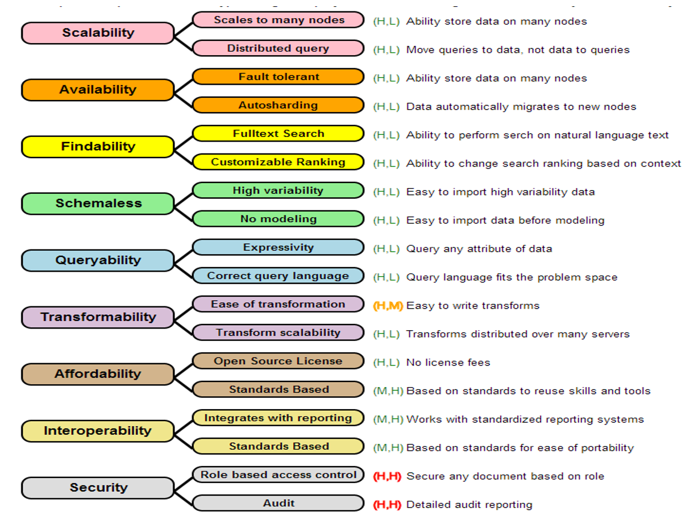

# Utility Tree

## Overview

A Utility Tree, also known as a Quality Tree, is a hierarchical model that represents various quality attributes (often non-functional requirements) that are significant for the success of a software project. It helps stakeholders to prioritize requirements by assessing their importance and the ease with which they can be fulfilled by a given architecture.

## Creating an Intuitive Measure of Fitness for a Task

Our goal in creating quality tree diagrams is to create an intuitive
visualization of the "fitness" of a database for a given application.
Think of this as trying to see if a glove fits your hand.  Each finger needs to fit well in the glove.

Think of each finger as a "dimension" of fitness.  At the end of trying on gloves, you will get an overall feeling of how specific gloves fit.  Our
goal is to not focus on just one dimension of fitness, but to get
a more holistic feeling for the fitness of the most critical
aspects of the suitability of a database for a project.

## Non-Functional Requirements (NFRs)

Non-functional requirements are criteria that specify the operation of a system, as opposed to the behaviors or functions the system must perform. These include aspects like scalability, performance, security, and usability. In the context of databases, NFRs are crucial because they define how the system should behave under various conditions and constraints.

**Examples of Non-Functional Requirements for a Database:**

1.  **Scalability**: The ability of the database to handle increased loads by adding resources.
2.  **Availability**: The degree to which the database is operational and accessible when required for use.
3.  **Security**: Protection of data against unauthorized access and ensuring confidentiality, integrity, and availability of data.
4.  **Performance**: The speed with which the database processes transactions and returns results.
5.  **Maintainability**: How easily the database can be modified to add new features, fix bugs, or improve performance.

**Quality Tree for Database Selection:** The image provided exemplifies a Quality Tree where each "ility" is a branch representing a key quality attribute of a database. Each attribute is further broken down into specific characteristics that can be evaluated.

**The "-ilities" Listed with Two Scores:** Each quality attribute is assessed based on two dimensions:

1.  **Importance to the success of the project (I)**: Ranks how critical the attribute is to the project's success, scored as Critical (C), High (H), Medium (M), or Low (L).
2.  **Ease of fulfillment by the architecture (E)**: Measures how easily a given architecture can fulfill the requirement, scored as Easy (E), Medium (M), or Hard (H).

**Quality Tree Descriptions Based on the Image:**

1.  **Scalability (H, L)**: Critical for handling growth but can be challenging to implement, requiring the architecture to manage data across multiple nodes and support distributed queries.

2.  **Availability (H, L)**: High importance for continuous operation, particularly in distributed systems where fault tolerance and automatic data migration to new nodes are essential.

3.  **Findability (H, L)**: The ease of locating information via full-text search and customizable ranking is crucial for user satisfaction.

4.  **Schemaless (H, L)**: Important for flexibility in handling various data types without predefined models, which can be both a boon and a challenge depending on the use case.

5.  **Queryability (H, L)**: A database's capacity to query any data attribute and fit the query language to the problem space is essential for effective data retrieval.

6.  **Transformability (H, M)**: The ability to easily write data transformations and distribute them over many servers is critical for data processing but might require moderate effort to implement.

7.  **Affordability (H, L)**: Cost is always a consideration; open-source licenses offer significant savings but may vary in ease of integration with existing systems.

8.  **Interoperability (M, H)**: The ability to integrate with reporting tools and standardized systems is highly important for a holistic data environment, often facilitated by adherence to standards.

9.  **Security (H, H)**: Ensuring robust security measures like role-based access control and audit capabilities is critical and typically requires substantial effort to implement effectively.

In summary, a Quality Tree is a visual representation that helps in the decision-making process when selecting a database for a project. It lays out the NFRs in a structured format, allowing stakeholders to discuss, prioritize, and decide which qualities are most important and how feasible they are to implement with the chosen architecture. This approach enables a balanced assessment of potential trade-offs and ensures that the selected database aligns with the project's goals and constraints.