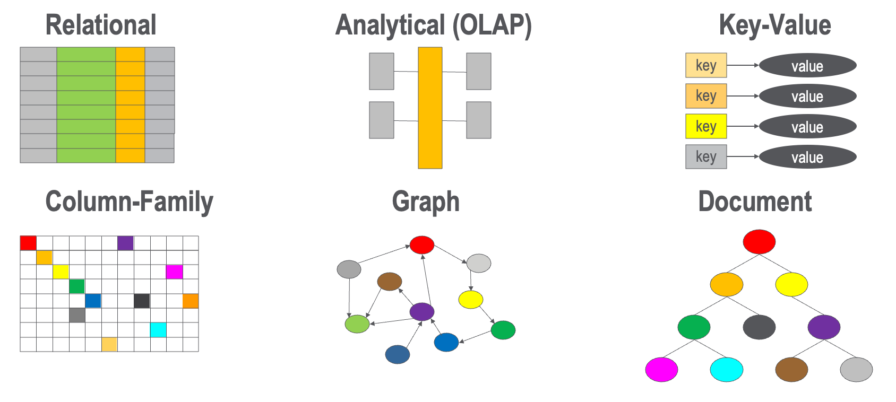

# Database Architecture Types

In this section, we will cover the six key database architecture
types we use when selecting the right database architecutre.

The six types are:

1. [Relational](relational/index.md)
2. [Analytical](analytical/index.md) (OLAP Cubes)
3. [Key Value Stores](key-value.md)
4. [Column Family Stores](column-family/index.md)
5. [Graph](graph/index.md)
6. [Document](document/index.md)

Each of these database architectures have many sub-types
and each of these have pros and cons for different applications.

It today's AI-driven world, graphs have become a major force.
We will cover this topic in the next section.

Here is a brief overview of these six database architecture patterns:

## Relational or OLTP

## Analytical or OLAP

## Key Value Stores

## Column Family Stores

## Graph

## Document

