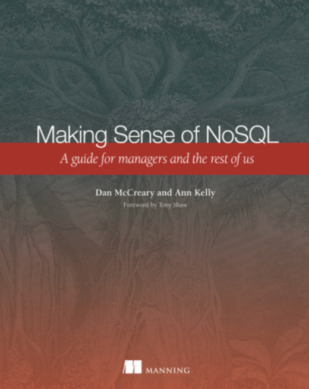

# Architecture Tradeoff Analysis Methodology

Welcome to our ATAM website!

This website stores resources for teaching courses
on the Architecture Tradeoff Analysis Methodology (ATAM) with NoSQL
databases.
ATAM was originally developed by Carnegie Mellon University (CMU)
for selecting the appropriate architectures for large computer projects.

We have adapted ATAM for use in helping organizations find
the best **database** architecture for a business challenge.

This site supports our main textbook:

[Making Sense of NoSQL](https://www.manning.com/books/making-sense-of-nosql)

Please let me know if you have any questions.

[Dan McCreary on LinkedIn](https://www.linkedin.com/in/danmccreary/)

