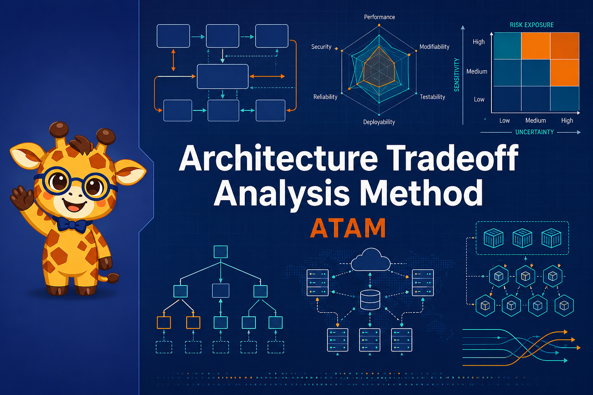

# Architecture Tradeoff Analysis Method

<figure markdown>
  { width="100%" }
</figure>

!!! mascot-welcome "Welcome from Vista!"
    
    Fellow architects! I'm Vista — and from up here I can see the whole system. Architecture decisions made early
    are the hardest to reverse later. This book gives you the structured tools to surface risks and tradeoffs
    *before* implementation locks them in. Let's weigh the tradeoffs!

**Architecture Tradeoff Analysis Method (ATAM)** is a graduate-level interactive textbook on the structured architecture evaluation technique developed at the Carnegie Mellon Software Engineering Institute (SEI). It teaches you to evaluate software architectures against explicit quality attribute requirements — performance, availability, security, modifiability, scalability — and communicate findings to both technical teams and executive stakeholders.

**Audience:** Graduate students in Computer Science and Software Engineering; experienced software architects and practitioners pursuing professional development.

## What's Inside

| Resource | Count |
|----------|-------|
| Chapters | 18 |
| Concepts (Learning Graph) | 350 |
| Glossary Terms | 350 |
| FAQ Questions | 56 |
| Interactive MicroSims | 43 |
| Diagrams | 52 |
| Estimated Reading Pages | ~606 |

## Chapter Overview

The 18 chapters progress from architecture fundamentals through advanced ATAM facilitation and into modern system evaluation challenges:

**Part I — Foundations (Chapters 1–2)**
Software architecture fundamentals, architectural decisions, quality goals, and governance principles that underpin all architectural reasoning.

**Part II — ATAM Method (Chapters 3–4)**
The complete ATAM process — Phase 1 and Phase 2 activities, team formation, scripted presentations, stakeholder analysis, and business driver elicitation.

**Part III — Quality Analysis (Chapters 5–7)**
The eight core quality attributes, quality attribute scenario construction using the six-component stimulus-response model, and utility tree construction and prioritization workshops.

**Part IV — Patterns, Tactics, and Risk (Chapters 8–10)**
Architectural patterns and styles, quality attribute tactics and tactic interactions, sensitivity points, tradeoff points, risk identification and classification, and professional ATAM evaluation reports.

**Part V — Modern Architectures (Chapters 11–18)**
Applying ATAM to distributed systems, cloud-native platforms, security architecture, performance engineering, observability, and AI/ML system evaluation including LLMs, RAG architectures, and autonomous systems.

## Supporting Content

This textbook includes a full layer of supplementary content to support self-study, classroom use, and professional development:

- **[Glossary](glossary.md)** — 350 ISO 11179-compliant definitions covering every concept in the learning graph
- **[FAQ](faq.md)** — 56 curated questions spanning all six chapters sections, from course prerequisites to advanced AI/ML evaluation scenarios
- **[Learning Graph](learning-graph/index.md)** — Interactive 350-concept dependency graph showing how concepts build on each other across all 18 chapters
- **[MicroSims](sims/index.md)** — Browser-based interactive simulations embedded throughout the chapters
- **Chapter Quizzes** — 12-question quizzes at the end of each chapter covering multiple Bloom's Taxonomy levels
- **Chapter References** — 10–14 annotated sources per chapter linking to SEI technical reports, IEEE publications, and open-access resources

## Getting Started

New to ATAM? Start with **[Chapter 1: Software Architecture Foundations](chapters/01-software-architecture-foundations/index.md)** and read chapters in order — each chapter's concepts build on prerequisites established earlier.

Already familiar with architecture basics? Use the **[Learning Graph viewer](sims/graph-viewer/index.md)** to identify which concepts you already know and jump directly to the chapters where your gaps are.

Preparing for an ATAM evaluation? Chapters 3–10 cover the full method. Chapter 10 synthesizes everything into a professional evaluation report workflow.

## Open and Free

This entire textbook is **open source and free** — no paywalls, no access codes, no annual editions. Fork it, adapt it, or embed MicroSims in your own course pages. Licensed under [CC BY-NC-SA 4.0](license.md) for non-commercial use.

[Chapters](chapters/index.md){ .md-button .md-button--primary }
[Learning Graph](learning-graph/index.md){ .md-button }
[Glossary](glossary.md){ .md-button }
[About](about.md){ .md-button }
