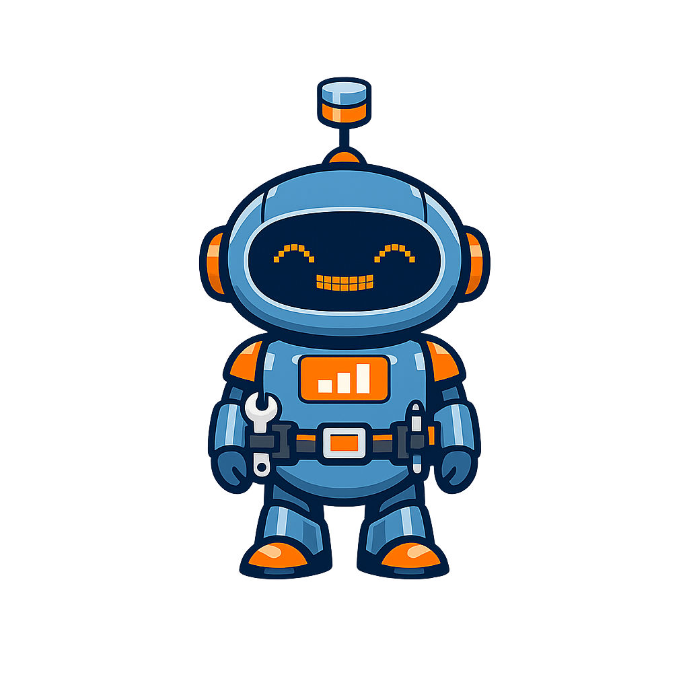

# Mascot Style Guide: Dex the Robot

This page exercises every admonition style for Dex the Robot. Use it to verify
that images load, colors render correctly, and text wraps cleanly around the
floated mascot image at various screen widths.

---

!!! mascot-neutral "A Note from Dex"
    
    This is the neutral style — used for general sidebars, introductions, or any
    content that doesn't call for a specific emotional tone. Think of it as Dex
    standing by, ready to assist.

---

!!! mascot-welcome "Welcome!"
    
    Welcome to this chapter! I'm Dex, your guide through database architecture
    and tradeoff analysis. Let's analyze the tradeoffs — together we'll build
    the judgment to choose wisely and document why.

---

!!! mascot-thinking "Key Insight"
    
    This is the thinking style — used for key concepts and architectural insights.
    When Dex appears here, pay close attention: this is a concept that recurs
    throughout the ATAM decision process.

---

!!! mascot-tip "Dex's Tip"
    
    This is the tip style — used for hints, shortcuts, and practical guidance.
    Dex points the way when there's a smarter path through a complex tradeoff.

---

!!! mascot-warning "Watch Out!"
    
    This is the warning style — used for common mistakes and architectural pitfalls.
    These are the decisions teams regret after a painful production incident.

---

!!! mascot-encourage "You Can Do This!"
    
    This is the encouraging style — used when the material gets genuinely hard.
    Distributed transactions, consensus protocols, five-nines SLAs — these take
    time to internalize. Every senior architect struggled with them too.

---

!!! mascot-celebration "Well Done!"
    
    This is the celebration style — used at chapter endings and major milestones.
    You've completed the chapter! Your utility tree is richer and your architectural
    decision record is stronger. Choose wisely — and document why!
