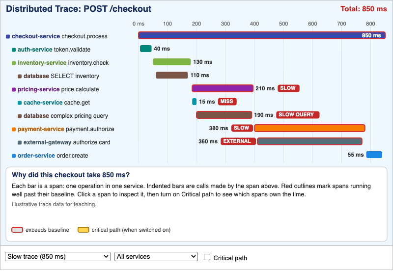
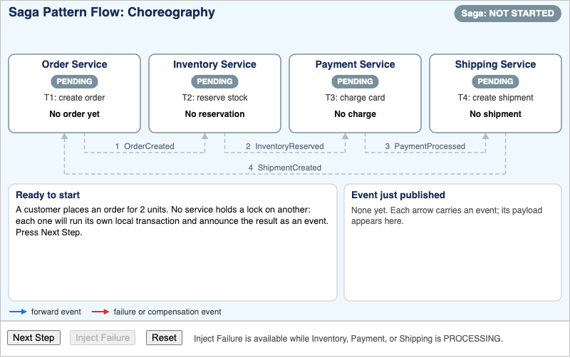
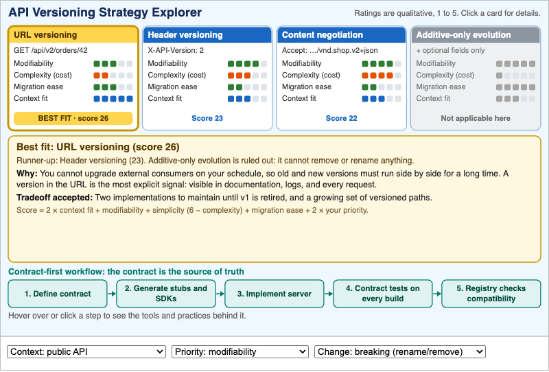
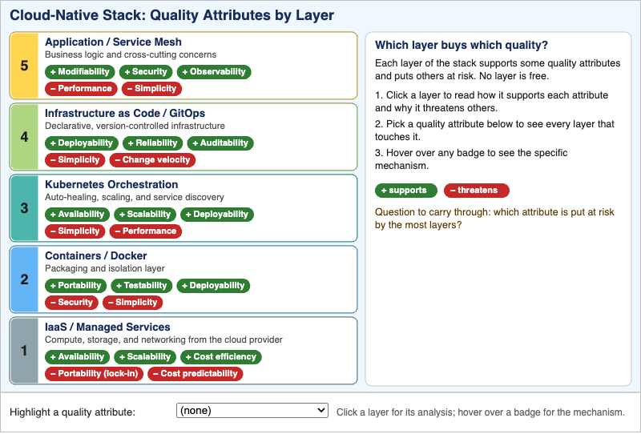
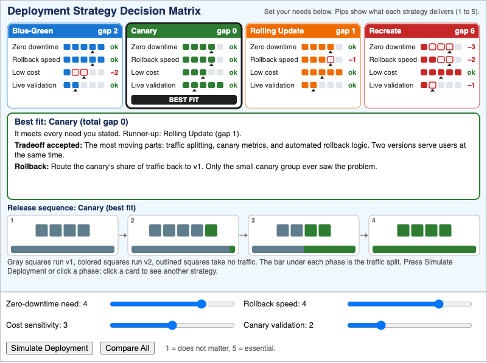
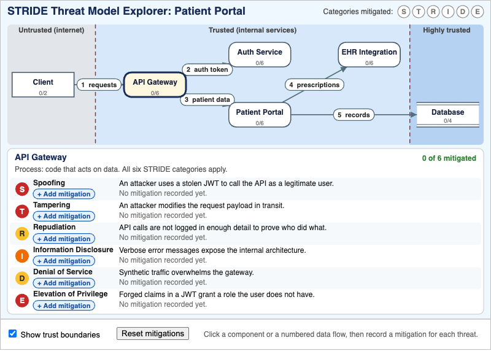
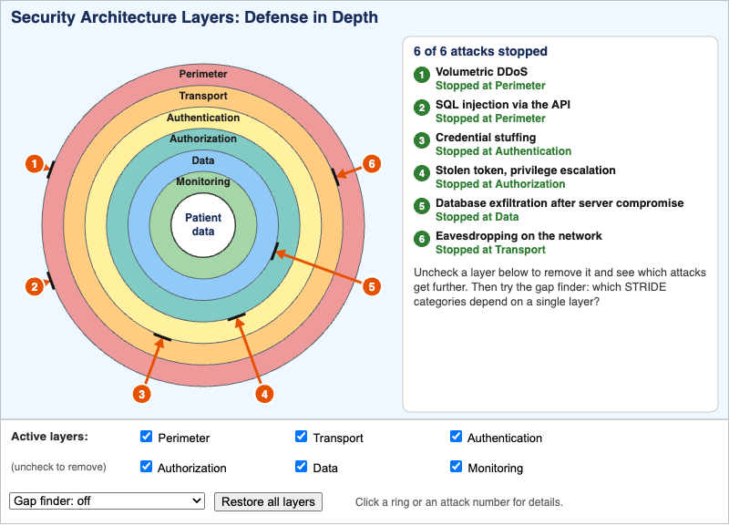
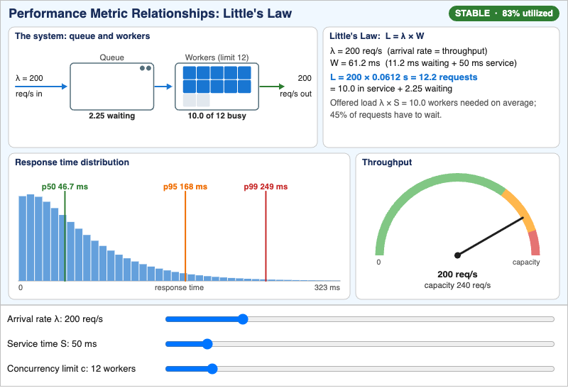
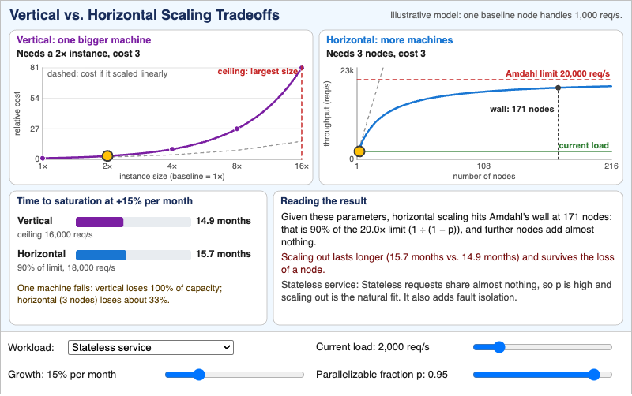

# MicroSims

MicroSims are small, interactive educational simulations — each one focused on
a single concept. They live under `docs/sims/<sim-name>/` and are embedded
into chapters via iframes.

New MicroSims can be created with the `microsim-generator` skill, which routes
to the appropriate library (p5.js, Chart.js, vis-network, Mermaid, Leaflet,
Plotly, Venn.js).

<!-- The MicroSim catalog is built up as new sims are added. -->

## Distributed Systems, Cloud, Security, and Performance (Chapters 11-15)

  <a href="distributed-trace-viewer/" title="Distributed Tracing Visualization" style="display:block;border:1px solid #e3e7ec;border-radius:8px;overflow:hidden;text-decoration:none;color:inherit;box-shadow:0 1px 3px rgba(0,0,0,0.08);">Distributed Tracing Visualization</a>
  <a href="saga-flow-simulator/" title="Saga Pattern Flow Simulator" style="display:block;border:1px solid #e3e7ec;border-radius:8px;overflow:hidden;text-decoration:none;color:inherit;box-shadow:0 1px 3px rgba(0,0,0,0.08);">Saga Pattern Flow Simulator</a>
  <a href="api-versioning-explorer/" title="API Versioning and Contract-First Design Patterns" style="display:block;border:1px solid #e3e7ec;border-radius:8px;overflow:hidden;text-decoration:none;color:inherit;box-shadow:0 1px 3px rgba(0,0,0,0.08);">API Versioning and Contract-First Design Patterns</a>
  <a href="cloud-native-qa-explorer/" title="Cloud-Native Architecture Quality Attribute Stack" style="display:block;border:1px solid #e3e7ec;border-radius:8px;overflow:hidden;text-decoration:none;color:inherit;box-shadow:0 1px 3px rgba(0,0,0,0.08);">Cloud-Native Architecture Quality Attribute Stack</a>
  <a href="deployment-strategy-selector/" title="Deployment Strategy Decision Matrix" style="display:block;border:1px solid #e3e7ec;border-radius:8px;overflow:hidden;text-decoration:none;color:inherit;box-shadow:0 1px 3px rgba(0,0,0,0.08);">Deployment Strategy Decision Matrix</a>
  <a href="stride-threat-explorer/" title="STRIDE Threat Model Explorer" style="display:block;border:1px solid #e3e7ec;border-radius:8px;overflow:hidden;text-decoration:none;color:inherit;box-shadow:0 1px 3px rgba(0,0,0,0.08);">STRIDE Threat Model Explorer</a>
  <a href="security-architecture-layers/" title="Security Architecture Layers" style="display:block;border:1px solid #e3e7ec;border-radius:8px;overflow:hidden;text-decoration:none;color:inherit;box-shadow:0 1px 3px rgba(0,0,0,0.08);">Security Architecture Layers</a>
  <a href="performance-metrics-explorer/" title="Performance Metric Relationships" style="display:block;border:1px solid #e3e7ec;border-radius:8px;overflow:hidden;text-decoration:none;color:inherit;box-shadow:0 1px 3px rgba(0,0,0,0.08);">Performance Metric Relationships</a>
  <a href="scaling-tradeoff-explorer/" title="Vertical vs. Horizontal Scaling Tradeoffs" style="display:block;border:1px solid #e3e7ec;border-radius:8px;overflow:hidden;text-decoration:none;color:inherit;box-shadow:0 1px 3px rgba(0,0,0,0.08);">Vertical vs. Horizontal Scaling Tradeoffs</a>

