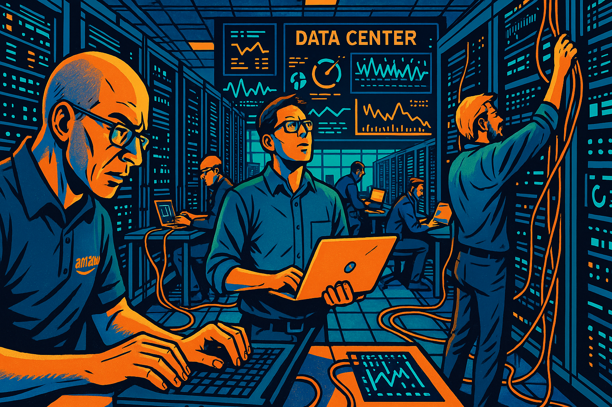

# The Story of DynamoDB: From Relational Failures to Distributed Key-Value Store

   
Narrative Prompt

Create a narrative for a story about the creation of Amazon's DynamoDB.

Describe how upset that Jeff Bezos was that the Oracle databases behind the shopping cart application kept crashing.

Show Jeff's anger yelling at a room of 200 Oracle consultants.

Show how Jeff said that nothing should ever block a shopping cart at checkout.

Show how brilliant engineers within Amazon that devised a plan to replace Oracle.

Show how they invented the Paxos algorithm to figure out what servers should take over in a cluster if one server fails.

Show the transition off or Oracle to the new DynamoDB.

Add a scene a huge party at Amazon when the decommissioned the last Oracle server.

The narrative should describe each image with a detailed image prompt that uses the
following template:

 

 

   
Image NN Prompt

   Image NN 
   Please generate a graphic-novel style drawing using a tech-forward optimistic high energy color scheme.  Generate the drawing using a wide-landscape format.

   ...description of image to be given to a text-to-image program...

 
Create 10 real working references using the following format:
 
## References
 
1. [Title](WORKING_URL) - publication_date - publication_name - description_and_relevance
 

## Chapter 1: The Breaking Point

It was Black Friday 2004, and Jeff Bezos was watching his worst nightmare unfold in real-time. The Amazon shopping cart system, built on Oracle databases, was crashing under the holiday traffic load. Customers were losing their carefully curated carts just as they reached checkout, abandoning purchases worth millions of dollars.

   
Image 01 Prompt

   Image 01
   Please generate a graphic-novel style drawing using a tech-forward optimistic high energy color scheme.  Generate the drawing using a wide-landscape format.

   A tense data center scene showing multiple computer monitors displaying error messages and red warning alerts. Jeff Bezos stands in the center, his face showing intense frustration as he watches shopping cart failure statistics climbing on large wall-mounted displays. Amazon engineers in the background are frantically typing on keyboards, their faces illuminated by the glow of error-filled screens. The scene should convey urgency and crisis, with dramatic lighting emphasizing the gravity of the situation.

The metrics were devastating: cart abandonment rates spiking to 40%, database connection timeouts climbing into the thousands, and customer service phones ringing off the hook. Each crash represented not just lost revenue, but damaged customer trust that had taken years to build.

   
Image 02 Prompt

   Image 02
   Please generate a graphic-novel style drawing using a tech-forward optimistic high energy color scheme.   Generate the drawing using a wide-landscape format.

   A split-screen view showing frustrated customers on the left side staring at "Service Unavailable" error pages on their computer screens, with shopping carts full of items they can't purchase. On the right side, show graphs and charts displaying plummeting sales metrics, rising error rates, and customer satisfaction scores dropping. The contrast should emphasize the human impact of technical failures.

Bezos had built Amazon on the principle that technology should enable commerce, not hinder it. But Oracle's single-point-of-failure architecture meant that when one database server went down, thousands of customers lost their shopping carts instantly. The traditional relational database model that worked for smaller e-commerce sites was buckling under Amazon's massive scale.

## Chapter 2: The Confrontation

The following Monday, Bezos convened an emergency meeting in Amazon's largest conference room. Facing him were nearly 200 Oracle consultants, database administrators, and technical specialists who had been brought in over the past year to solve the scaling problems. The tension in the room was palpable.

   
Image 03 Prompt

   Image 03
   Please generate a graphic-novel style drawing using a tech-forward optimistic high energy color scheme.  Generate the drawing using a wide-landscape format.

   A large corporate conference room with floor-to-ceiling windows overlooking Seattle. Jeff Bezos stands at the head of a massive conference table, his body language showing controlled anger as he addresses rows of Oracle consultants in business suits. The consultants look uncomfortable and defensive, some looking down at their laptops, others exchanging worried glances. The scene should convey the power dynamic and tension of a high-stakes confrontation.

"We've spent millions on Oracle licenses, millions more on your consulting fees, and millions in lost revenue because your system can't handle our traffic," Bezos began, his voice calm but carrying an edge that everyone in the room recognized. "Every time we scale up, you tell us we need bigger servers, more expensive hardware, more complex configurations."

The Oracle team's lead architect stood up nervously. "Mr. Bezos, enterprise databases require careful capacity planning and—"

"No!" Bezos slammed his hand on the table, his composure finally breaking. "I don't want to hear about capacity planning! I want to hear about a system that scales automatically, that doesn't lose customer data when a server fails, that doesn't require a team of consultants to keep running!"

   
Image 04 Prompt

   Image 04
   Please generate a graphic-novel style drawing using a tech-forward optimistic high energy color scheme.  Generate the drawing using a wide-landscape format.

   A dynamic scene capturing Jeff Bezos mid-gesture, pointing emphatically while speaking. His expression shows passionate intensity as he makes his point. The Oracle consultants in the background appear taken aback, some leaning back in their chairs. The composition should emphasize Bezos's determination and leadership presence, with dramatic lighting highlighting his figure against the corporate meeting room backdrop.

The room fell silent. Bezos continued, his voice rising: "Every shopping cart that gets lost is a customer we've let down. Every database crash is a betrayal of their trust. This ends now. We're going to build our own solution, and it's going to be better than anything Oracle can provide."

## Chapter 3: The Vision

As the Oracle consultants filed out of the conference room, looking shell-shocked, Bezos turned to his core engineering team. Werner Vogels, Amazon's CTO, stepped forward with a small group of the company's most brilliant engineers: Swaminathan Sivasubramanian, Prashant Malik, and Alex Verbitski.

   
Image 05 Prompt

   Image 05
   Please generate a graphic-novel style drawing using a tech-forward optimistic high energy color scheme.  Generate the drawing using a wide-landscape format.

   A smaller, more intimate meeting space with Jeff Bezos and his core engineering team gathered around a whiteboard. Werner Vogels is sketching distributed system diagrams while other engineers look on intently. The mood should be creative and collaborative, with coffee cups, laptops, and technical drawings scattered around. The lighting should suggest this is a pivotal brainstorming moment.

"Here's what I want," Bezos declared, writing on the whiteboard. "A database that scales horizontally across thousands of servers. A system where if one server fails, customers don't even notice. A platform that automatically distributes load and maintains data integrity without human intervention."

Vogels nodded thoughtfully. "What you're describing is a distributed key-value store with eventual consistency. It's theoretically possible, but it would require solving some fundamental computer science problems."

"Then let's solve them," Bezos replied without hesitation. "Nothing should ever block a shopping cart at checkout. Nothing. If that means we have to reinvent how databases work, then that's what we'll do."

   
Image 06 Prompt

   Image 06
   Please generate a graphic-novel style drawing using a tech-forward optimistic high energy color scheme.  Generate the drawing using a wide-landscape format.

   A close-up of a whiteboard covered in technical diagrams showing distributed systems architecture. Hands holding markers are drawing connections between server nodes, with arrows indicating data flow and replication patterns. The drawing should emphasize the complexity and elegance of distributed system design, with clean technical aesthetics.

The engineering team exchanged excited glances. This wasn't just about fixing a database problem—Bezos was asking them to pioneer an entirely new approach to data storage that could revolutionize how web-scale applications worked.

## Chapter 4: The Innovation

Over the following months, Amazon's engineers dove deep into distributed systems research. They studied Google's Bigtable papers, examined academic research on consensus algorithms, and most importantly, they tackled the challenge of distributed consensus—how to ensure multiple servers could agree on data changes even when some servers failed.

   
Image 07 Prompt

   Image 07
   Please generate a graphic-novel style drawing using a tech-forward optimistic high energy color scheme.  Generate the drawing using a wide-landscape format.

   A montage-style image showing Amazon engineers working intensively. Multiple panels show: researchers reading academic papers with complex mathematical formulas, engineers coding at multiple monitors, and team members debating at whiteboards covered in distributed systems diagrams. The overall composition should convey intense intellectual work and collaboration.

The breakthrough came when they implemented and refined consensus algorithms inspired by Leslie Lamport's Paxos protocol. Their innovation was adapting these academic concepts for the practical needs of a high-traffic e-commerce platform. They needed a system that could handle millions of shopping cart operations per day while guaranteeing that customer data would never be lost.

Sivasubramanian led the charge on the consensus implementation. "The key insight," he explained to the team, "is that we don't need perfect consistency for shopping carts. We need eventual consistency with strong durability guarantees. A customer can tolerate a few seconds of delay much better than losing their entire cart."

   
Image 08 Prompt

   Image 08
   Please generate a graphic-novel style drawing using a tech-forward optimistic high energy color scheme.  Generate the drawing using a wide-landscape format.

   A visualization of the distributed consensus algorithm in action. Show multiple server nodes (represented as glowing geometric shapes) communicating with each other through network connections. Data packets flow between nodes, and the image should illustrate the concept of distributed agreement and data replication. Use abstract but technical imagery to convey the elegance of the solution.

Their implementation created a self-healing distributed system where customer data was automatically replicated across multiple servers and data centers. When one server failed, the system would automatically route traffic to healthy nodes while recovering the failed component in the background—all invisible to customers.

## Chapter 5: Building the Future

The development of what would become DynamoDB took nearly two years of intensive work. The team had to solve problems that had never been tackled at this scale: automatic data partitioning, consistent hashing for data distribution, and real-time load balancing across thousands of servers.

   
Image 09 Prompt

   Image 09
   Please generate a graphic-novel style drawing using a tech-forward optimistic high energy color scheme.  Generate the drawing using a wide-landscape format.

   A vast data center floor showing rows of servers with Amazon engineers working among them. Cables and network equipment are visible, with monitoring screens displaying system health metrics. The scene should convey the scale and complexity of building a distributed database system, with engineers both planning and implementing their vision.

The first major test came during the 2006 holiday season. The new distributed database, initially called "Dynamo" internally, handled Black Friday traffic without a single shopping cart loss. While Oracle-based competitors struggled with outages, Amazon's checkout process ran seamlessly.

Werner Vogels watched the monitoring dashboards with amazement. "Look at this," he called to the team. "We just processed 10 million shopping cart operations in the last hour, and the system automatically scaled to handle the load. No human intervention required."

   
Image 10 Prompt

   Image 10
   Please generate a graphic-novel style drawing using a tech-forward optimistic high energy color scheme.  Generate the drawing using a wide-landscape format.

   A celebration scene in the Amazon monitoring center. Engineers are cheering and high-fiving while looking at dashboard screens showing perfect system performance metrics during peak traffic. Green indicators and upward-trending graphs dominate the displays. The mood should be jubilant and triumphant, capturing the success of their hard work.

Bezos was vindicated. His vision of a database that could scale automatically and never lose customer data had become reality. More importantly, Amazon now had a competitive advantage that no other e-commerce company could match.

## Chapter 6: The Transition

The migration from Oracle to the new distributed system was methodical and careful. Critical applications were moved one by one, with extensive testing and rollback procedures. The shopping cart system was the first major migration, followed by product catalog data, and eventually customer account information.

   
Image 11 Prompt

   Image 11
   Please generate a graphic-novel style drawing using a tech-forward optimistic high energy color scheme.  Generate the drawing using a wide-landscape format.

   A split-screen showing the old Oracle servers on the left (dark, imposing, centralized) gradually being replaced by the new distributed system on the right (bright, networked, dynamic). Show data flowing from the old system to the new, with engineers orchestrating the migration process. The visual should emphasize the transformation from centralized to distributed architecture.

Each successful migration proved the superiority of the new approach. Applications that previously required constant monitoring and manual intervention now ran themselves. Database administrators who once spent their nights dealing with Oracle outages could focus on developing new features instead of fighting fires.

The business impact was immediate and dramatic. Amazon's uptime during peak shopping periods improved from 99.9% to 99.99%. Customer satisfaction scores increased as shopping cart abandonment due to technical issues dropped to near zero.

## Chapter 7: The Final Victory

By 2010, Amazon had migrated all critical systems off Oracle. The last remaining Oracle server handled some legacy reporting functions that were no longer business-critical. When the engineering team finally scheduled its decommissioning, Bezos declared it would be a company-wide celebration.

   
Image 12 Prompt

   Image 12
   Please generate a graphic-novel style drawing using a tech-forward optimistic high energy color scheme.  Generate the drawing using a wide-landscape format.

   The Amazon campus courtyard filled with hundreds of employees gathered for a celebration. A single Oracle server sits on a raised platform in the center, decorated with ribbons like it's being retired. Jeff Bezos stands at a podium addressing the crowd, with the Seattle skyline visible in the background. The mood should be festive and triumphant.

"Today marks the end of an era," Bezos announced to the gathered crowd of Amazon engineers, product managers, and executives. "Six years ago, we were held hostage by database technology that couldn't scale with our ambitions. Today, we run on a system that our own engineers built—a system that's not just better than what we replaced, but better than anything else in the industry."

The crowd erupted in applause as Vogels symbolically unplugged the final Oracle server. What had started as frustration with database failures had evolved into a foundational technology that would eventually become Amazon Web Services' DynamoDB—a service used by millions of developers worldwide.

   
Image 13 Prompt

   Image 13
   Please generate a graphic-novel style drawing using a tech-forward optimistic high energy color scheme.  Generate the drawing using a wide-landscape format.

   A dramatic moment showing Werner Vogels pulling the power cord from the last Oracle server while Jeff Bezos and hundreds of Amazon employees cheer in the background. Confetti falls from above, and the scene should capture the symbolic nature of this moment—the end of dependence on external database technology and the beginning of Amazon's database independence.

## Chapter 8: The Legacy

The technology that began as a solution to Oracle's shopping cart failures became one of Amazon's most successful products. DynamoDB, launched as part of AWS in 2012, democratized access to the same distributed database technology that powered Amazon's e-commerce platform.

   
Image 14 Prompt

   Image 14
   Please generate a graphic-novel style drawing using a tech-forward optimistic high energy color scheme.  Generate the drawing using a wide-landscape format.

   A world map showing data centers connected by flowing light streams, representing DynamoDB's global reach. Customer logos from various industries (gaming, fintech, retail, healthcare) appear as nodes in the network. The visualization should convey how the technology born from Amazon's specific needs became a global platform serving diverse industries.

Companies like Netflix, Airbnb, and Samsung now relied on the same technology that Bezos had envisioned during those frustrating Oracle outages. The distributed database that started as an internal solution to shopping cart crashes had evolved into infrastructure that powered applications serving billions of users worldwide.

Looking back, the Oracle crisis that once threatened Amazon's growth had become the catalyst for one of its greatest innovations. Bezos's refusal to accept database limitations had not only solved Amazon's immediate problems but created a new category of database technology that would influence how all web-scale applications managed data.

   
Image 15 Prompt

   Image 15
   Please generate a graphic-novel style drawing using a tech-forward optimistic high energy color scheme.  Generate the drawing using a wide-landscape format.

   A final panoramic view showing the evolution from that first crisis meeting to global success. Show a timeline visualization with key moments: the Oracle crisis, the engineering breakthrough, the migration, and finally DynamoDB's global adoption. Jeff Bezos appears contemplative in the foreground, reflecting on the journey from problem to solution to industry transformation.

The story of DynamoDB proved that the greatest innovations often emerge from the most frustrating limitations. When existing technology couldn't meet Amazon's needs, they didn't just work around the problem—they reimagined what was possible and built the future they wanted to see.

## References

1. [Link to YouTube Video of final Oracle decomissioning at Amazon](https://youtu.be/9yBP5gnnZi4?si=hP5ryUuhBfv9gQY-) - Amazon.com shut down its last Oracle database and migrated to AWS. They migrated 75 petabytes of internal data stored in 7,500 Oracle databases to multiple AWS database services including Amazon DynamoDB, Amazon Aurora, Amazon Relational Database Service (RDS), and Amazon Redshift. These migrations were accomplished with little or no downtime. This is the footage from the shutdown of the final Oracle database and a quick celebration.  Posted Oct 16, 2019.

<iframe width="560" height="315" src="https://www.youtube.com/embed/9yBP5gnnZi4?si=VqysqB8xMlECn5jr" title="YouTube video player" frameborder="0" allow="accelerometer; autoplay; clipboard-write; encrypted-media; gyroscope; picture-in-picture; web-share" referrerpolicy="strict-origin-when-cross-origin" allowfullscreen></iframe>

1.  [Dynamo: Amazon's Highly Available Key-value Store](https://dl.acm.org/doi/10.1145/1294261.1294281) - October 2007 - ACM SOSP - The original academic paper by Amazon engineers describing the distributed database technology that became DynamoDB, detailing consensus algorithms and eventual consistency models.
2.  [Amazon DynamoDB Launch Announcement](https://aws.amazon.com/about-aws/whats-new/2012/01/18/aws-announces-dynamodb/) - January 18, 2012 - AWS - Official announcement of DynamoDB as a commercial service, marking the transition from internal Amazon technology to public cloud offering.
3.  [Migration Complete -- Amazon's Consumer Business Just Turned off its Final Oracle Database](https://aws.amazon.com/blogs/aws/migration-complete-amazons-consumer-business-just-turned-off-its-final-oracle-database/) - November 3, 2022 - AWS News Blog - Detailed account of Amazon's complete migration from Oracle to AWS services, including performance improvements and cost savings.
4.  [Amazon Database Migration Case Study](https://aws.amazon.com/solutions/case-studies/amazon-database-migration/) - 2022 - AWS Case Studies - Comprehensive overview of how Amazon migrated 75 petabytes from 7,500 Oracle databases to multiple AWS database services with zero downtime.
5.  [Eventually Consistent](https://queue.acm.org/detail.cfm?id=1466448) - October 2008 - ACM Queue - Werner Vogels's foundational paper explaining eventual consistency models and the trade-offs between consistency and availability in distributed systems.
6.  [Amazon's DynamoDB --- 10 years later](https://www.amazon.science/latest-news/amazons-dynamodb-10-years-later) - January 18, 2022 - Amazon Science - Retrospective interview with DynamoDB co-creator Swaminathan Sivasubramanian on the origins and evolution of DynamoDB technology.
7.  [Motivations for migration to Amazon DynamoDB](https://aws.amazon.com/blogs/database/motivations-for-migration-to-amazon-dynamodb/) - August 23, 2023 - AWS Database Blog - Analysis of real-world DynamoDB migrations including Amazon Wallet's 10 billion record migration and performance improvements.
8.  [Amazon Dynamo Paper Background](https://www.allthingsdistributed.com/2007/10/amazons_dynamo.html) - October 2, 2007 - All Things Distributed - Werner Vogels's blog post introducing the Dynamo technology and explaining its significance for distributed systems research.
9.  [Amazon Prime Video DynamoDB Case Study](https://aws.amazon.com/solutions/case-studies/amazon-primevideo-dynamodb/) - 2022 - AWS Case Studies - Technical details of Prime Video's migration from Oracle to DynamoDB, including the challenges of migrating billions of ownership records.
10.  [Happy 10th Birthday, DynamoDB!](https://aws.amazon.com/blogs/aws/happy-birthday-dynamodb/) - March 11, 2025 - AWS News Blog - Celebration of DynamoDB's 10th anniversary with performance statistics including 89.2 million requests per second during Prime Day 2021.