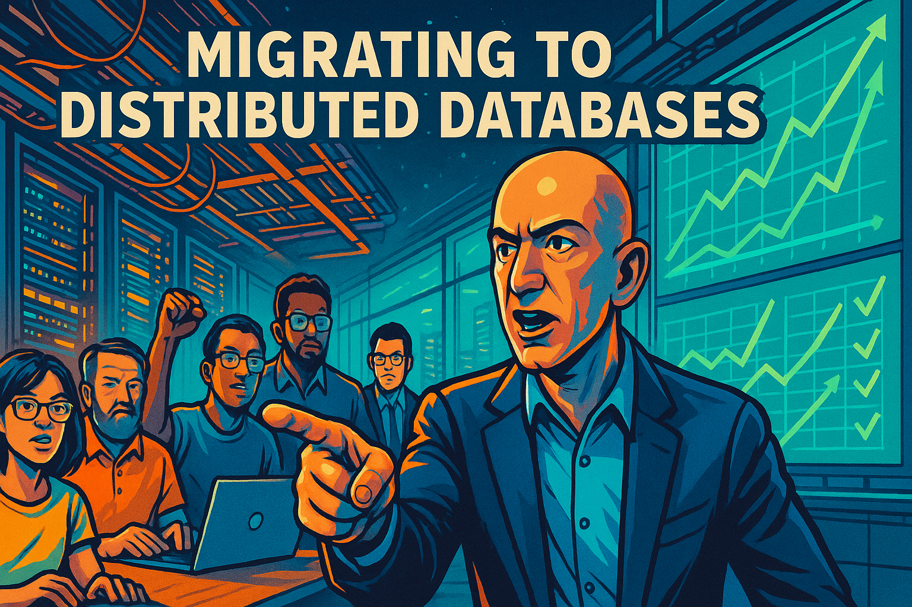

# NoSQL Stories

## DynamoDB

This is the story of how Amazon moved off of the Oracle relational database to a distributed key-value store database called DynamoDB.  The key lesson is that relational databases
do not scale well and favor consistency of reporting over non-blocking write-performace.

[Go to the DynamoDB Story](./dynamodb/index.md)